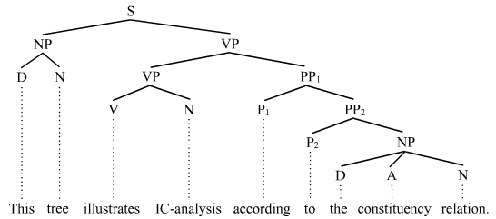
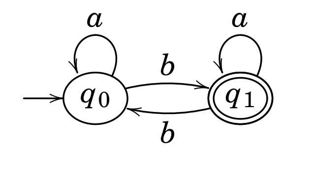
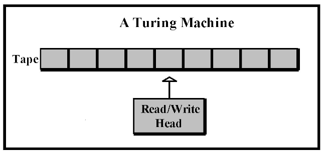

# Morphology

> __Morphology__ = the study of __words__: what they are, how they are formed and their different forms

In language technology, it is involved in:

- analysis: parsing, speech recognition, machine translation
- generation: language generation, machine translation

It's important to notice that it is even nontrivial to define what a word is, unless we only take _orthographic_ (i.e. separated by spaces when spelt) words into account (but even in that case, what about "tea-bag" and "I'll"?).

## Leading figures

1.  Pāṇini (India, IV century BCE), Greek and Arabic authors
2.  De Saussure (Switzerland, late XIX and early XX century)
3.  Bloomfield (USA, early XX century)
4.  Roman Jakobsson (Prague school, Czech Republic, first half of the XX century)

## Essential vocabulary

- _Word form_ or _orthographic word_ = a certain form of a certain lemma (e.g. the feminine form of an adjective in Italian, the _bestämd_ form of a Swedish word or the past simple of an English verb)

- _Grammatical word_ = words defined in terms of their place in the paradigm, described for instance as "the past simple of verb X"

- _Lexeme_ = abstract lexical entity consisting of __form + meaning__. It represents a
  set of forms (note: this is according to the slides. I actually think that a better definition would be: “__basic unit of a language with *lexical meaning*__ consisting of one or several words, the elements of which do not separately convey the (lexical) meaning of the whole”. An even clearer definition is: "the set of all forms that have the same meaning")

- _Lemma_ = basic form that represents the set of word forms of a lexeme e.g. in a dictionary (even though I cannot unsee that this is exactly how Bauer defines lexemes...)
  
- _Root_ = basic part of a lexeme not further analyzable either in terms of inflectional or derivational morphology, always present in every form (note: compounds have two roots)

- _Stem_ = a root or a root + a derivational morpheme changing its meaning (example: “deduce” is a stem but not a root, as it can be analysed in terms of “de” + “duce”)

- _String_ = sequence of characters

- _Morpheme_ = smallest meaningful unit (of a word). By _meaningful_, we refer both to lexical and grammatical meaning (see below), e.g. the word “unfair” is composed of two morphemes (“un” + “fair”). According to Bauer, this is actually how you define _morphs_, but as we will see later most sources agree on the fact that a morph is, instead, the _phonetic_ realization of that morpheme. They are divided into:
  - _free_ (standalone) morphemes
  - _bound_ morphemes (the _base_ of a word is the part to which bound morphemes are attached): 
    - _roots_
    - _affixes_: (prefixes, suffixes, infixes, circumfixes)
    - _clitics_: depend on other words, their host word can belong to several classes of words. Example: “the”, “a”
  
  Can also be divided into:
  
  - _lexical_
  - _grammatical_ (with one ore more meanings attached at the same time, cf. verb suffixes in Spanish ans Italian. In this latter case they are called _portmanteau morphemes_)
  
- _Morph_ = A phonetic (and sometimes orthographic) representation of a morpheme. Different morphemes associated with the same meaning (in complementary distribution) are called _allomorphs_. Examples:
  - the plural of the Swedish word “**fågel**” is “**fågl**ar”. “Fågel” and “fågl” are then allomorphs
  - “-s” and “-es” are allomorphs of the English plural morpheme
  - the English articles "a" and "an" are allomorphs

## Content VS function words

- _Content words_: __words with a clear *lexical meaning*__ (nouns, verbs, adjectives. Note that these classes of words all are _open classes_, i.e. it is possible to add them neologisms)
- _Function words_ : __words__ with no clear lexical meaning, __which__ instead __specify *grammatical functions* and relationships__ (conjunctions, prepositions, articles, pronouns. Note how they are all [almost: cf. “hen” in Swedish!] _closed classes_)

The brain treats content and functions words differently! In fact:

- Some aphasics are unable to read function words like “in” or “which”, but can read the lexical words “inn” and “witch”
- In early stages of development children often omit function words

## Word formation (morphological) processes

- _Coining_ (making up new terms)
- _Loan_ from other languages: andante, oxymoron...
- _Calque_ or _loan translation_: e-post, skyskrapa, scannerizzare, balonvolea...
- _Acronym_: ISA (Instruction Set Architecture), FLOSS (Free, Libre and Open Source)...
- _Clipping_ (word shortening): math, fax, phone...
- _Blending_ of the first part of the word with the ending part of another: brunch, smog, bankomat
- _Compounding_ (putting together 2+ lexemes that could function as independent words): geburtstagsgeschenk and many more examples in German and Swedish
- _Derivation_ (__turning a word into another word__, it often happens via _derivational affixes_ such as “-ism”) 
- _Inflection_ (__creation of a new word *form*__)
- ...

### Derivation vs inflection

|                                                | __Inflection__                           | __Derivation__ |
| ---------------------------------------------- | ---------------------------------------- | -------------- |
| creates a new part of speech (change of class) | rarely                                   | often          |
| creates a new lexeme                           | yes                                      | no             |
| changes in meaning (?)                         | significant                              | modification   |
| semantic effect                                | sometimes hard to predict: odjur, oväder | predictable    |

## Morpheme analysis

1. Structure the word forms
2. compare two forms which are as similar as possible and identify their common-and-not features (morphs/morphemes)
3. check what role the morphs that have been isolated have in other forms
4. check that the isolated morphs are in fact morphs in that they are “minimum”  

## Word classes
Traditional (classical) grammar attempts to classify words based on their function with respect to what can occur nearby (_syntactic distributional properties_) or based on to affixes they can take (_morphological properties_). More on that in the section about syntax, especially under "Types of POS".

## Typology (based on morphology)

Languages are grouped into categories based on morphology:

- **analytic**: one word, one morpheme, one meaning component (Chinese, English to a certain extent)

- **agglutinating**: one meaning per morpheme, words composed of several morphemes: (Turkish)
- **synthetic**
  - **inflectional**: several meanings per morpheme (Latin, Greek, English)	
  - **poly-synthetic**: a single word is possibly a sentence (Icelandic)
  - **non-concatenative**: base made of consonants, vowels infixed (Arabic, Hebrew)

## Typical morphology “problems”

- Where to split words? (“hoppa-r” or “hopp-ar”)
- what if there are multiple stems? (“vado”, “andare”)
- function or content? (“stor-het” vs “stor-lek”)
- what if identical morphs of the same lexeme indicate different morphemes? (e.g. Swedish adjectives terminate in ”-a” both in singular bestämd form and in plural obestämd form)

## Relationship with other subfields of linguistics

### Morphology

#### Morphosyntax
It’s often useful to talk about morphology and syntax together (__*morphosyntax*__) because some things are expressed morphologically in a language and syntactically in another. 

#### Grammar
One could also argue that syntax and morphology are so closely related that they should not be distinguished one from the other. Assuming this, we shall talk instead of __*grammar*__ (i.e. syntax + morphology). Traditional (classical) grammar tends adopt a _prescriptive_ approach. Nowadays, however a descriptive approach is preferred, based on the analysis of collections of real-world language samples. 

##### Structural analysis
One of the methods applied by those who follow a descriptive approach is called _structural analysis_. It investigates the distribution of forms in a language by checking what forms can fit certain "test frames". Example:
- Test frame: "The ___ makes a lot of noise"
- Possible fits: "car", "child", "dog", "radio"...
- Possible analysis: the possible fits all belong to the same grammatical category (Noun. But then wat about "Sam" and "A car"? Noun Phrase. It's interesting to notice that pro-nouns are actually pro-nounphrases!)

##### Constituent analysis
This (descriptive) technique is designed to show how small constituents form larger constructs. To a computer scientist, it really looks like building the AST of natural language sentences.

Using this kind of diagrams helps us understanding the types of form that can be substituted for each other at different levels, but also, at a higher level, to work out the grammatical functions of phrases (for instance, in the diagram above "This tree" is a Noun Phrase whose role is to be the subject).

### Lexicon

Lexicon should perhaps be considered alongside morphology and syntax. We shall define lexicon later on, but for now let’s just say that according to one possible (and rather broad) its “units”, called _lexical entries_ are idealized mental constructs such as the syntactic pattern “PREPOSITION + NOUN PHRASE” in English.

## Computational morphology

### Formal languages

> A _formal language_ is a set of strings, each composed of symbols from a finite set of symbols referred to as _alphabet_.

### Regular languages

A formal definition of regular languages:

- the empty language is a RL
- $\forall a \in \Sigma \cup \epsilon, {a}$ is a RL
- if $L_1$ and $L_2$ are RLs, then so are
  - $L_1 \cdot L_2 = {xy | x \in L_1, y \in L_2}$ (_concatenation_)
  - $L_1 \cup L_2$ (_union_ or _disjunction_)
  - $L_1*$ (and $L_2*$) (_Kleene closure_)

Regular languages are also closed under the following operations:

- intersection $\cap$
- difference between languages $-$
- complementation between $\Sigma*$ and the language $-$
- reversal $^{R}$ 

### Regular expressions

> Regular expressions (regex) are an algebraic notation for characterizing sets of strings. 

They are made of _atomic symbols_ (lowercase Latin letters) and operations. The fundamental ones are:

- __concatenation__ (no symbol: two expressions one next to the other are concatenated)
- __Kleene closure__ (denoted by `*`)

There are also some more specific useful operators (there are actually various conventions though):

| Operator | Meaning                                                                |
| -------- | ---------------------------------------------------------------------- |
| `?`      | the preceding character or nothing                                     |
| `*`      | 0+ occurrences of the previous characters (well, this is just Kleene)  |
| `+`      | 1c occurrences of the previous character ("Kleene +")                  |
| `.`      | whatever single character                                              |
| `^`      | start of the line (e.g. `^the` matches lines starting with “the”)      |
| `$`      | end of the line                                                        |
| `\d`     | any digit                                                              |
| `\b`     | any digit                                                              |
| `\B`     | boundary between words                                                 |
| `\D`     | non-boundary between words                                             |
| `\w`     | any alphanumeric character                                             |
| `\W`     | any non-alphanumeric character                                         |
| `\s`     | whitespace                                                             |
| `\S`     | non-whitespace                                                         |
| `|`      | logical or (usage: like `^`)                                           |
| `()`     | precedence (e.g. `(y|ies)`)                                            | 

#### Brackets

Some examples to illustrate the usage of the `[]` operator:

| Example expression | Matched characters |
| ------------------ | ------------------ |
| [Aa]               | A, a               |
| [A-Z]              | A, ..., Z            |
| [0-9]              | 0, ..., 9            |
| [a-z]              | a, ..., z            |
| [0-9 A-Z]          | 0, ..., 9, a, ..., z   |

### Finite-state automata

FSA are _directed graphs_ where nodes represent *states* and arcs, labelled with symbols, represent transitions.

They can also be represented as _transition tables_ (see example below).

More formally (but only to some extent because we haven’t defined everything),

> A FSA is a 5-uple
> $$
> <Q, \Sigma, q_0, F, \delta>
> $$
> where:
>
> - $Q$ is the set of states
> - $\Sigma$ is the (finite) _alphabet_
> - $q_0$ is the _start state_
>
> - $F \subseteq Q$ is a set of _final states_ (aka _accept states_)
> - $\delta : Q \times \Sigma \to Q$ is a transition function between states

#### Example

- $Q = {q_0, q_1}$
- $\Sigma = {a,b}$
- $q_0 = q_0$ (oh well!)
- $F = {q_1}$
- transition function: $\delta(q,i) = {q_0 \to q_0, q_0 \to q_1, q_1 \to q_0, q_1 \to q_1}$

#### ε-transitions

A _nondeterministic_ FSA may have ε-transitions, i.e. transitions without a corresponding symbol. NFAs with ε-transitions can effectively be converted to deterministic ones (DFAs). This means that they may be simpler to construct, but they are no more powerful than mere DFAs.

### Relationship between FSA, regular languages and regex

- regex _denote_ regular languages
- regex _compile into_ FSA
- FSA _accept_ (but also, from another point of view, _generate_)  regular languages

#### Recognition

> _Recognition_ is defined as:
>
> - the process of determining if a string should be accepted by an automaton
> - the process of determining if a string is in the language we’re defining with the automaton
> - the process of determining if a regular expression matches a string.

In _On computable numbers_ (A. Turing), recognition is described as the process of executing a tape divided into cells, using a read/write head (_Turing machine_). 

Such a machine is _universal_ for all unambiguous regular languages. This means that in order to change the behavior of the machine it suffices to change the tape (i.e. the program).

It works as follows:

1. Start from the initial state
2. Examine the current input (= read the symbol current cell)
3. Consult the _symbol table_
4. Go to a new state according to what the table says
5. ...
6. Until the tape ends

If, at any point in time, there is always only one thing to do, recognizing is said to be _deterministic_ (simple table-driven interpreter. This concepts applies directly to automata as well, and given a NFA (where “N” stands for “Non-deterministic”) it is always possible to algorithmically construct an equivalent DFA (where “D” stands for “Deterministic”). There are, then, two main approaches to recognition:

- Convert a NFA to a DFA and use the latter to perform recognition (__deterministic recognition__)
- Explicitly manage recognition as a _state-space search_ (__non-deterministic recognition__), leaving the machine be a DFA. In __state-space search__, states are pairs $(pos, state)$, where $pos$ is the a tape position and $state$ is a state number, operators are compiled into the table and a goal state is a pair where the first element is the final tape position and the second element is a final state. Note that in a NFA there is at least a path from the initial state to a final state for each string in the language (finding such path means successful recognition!), but that doesn’t mean that all paths corresponding to that string end in a final state, so it is useful to have some backup strategy, such as marking choice points (**backtracking**). Other useful techniques are **look-ahead**, **parallelism**.

#### From regex to FSA (syntheses)

See “Sintesi” in LFC notes by Arturo Carpi.

### FST (Finite State Transducers)

A FST is a finite-state machine with _two_ memory tapes (an input tape and an output tape). It is, then, a generalization of a FSA, which is single-taped: a FSA defines a formal language by defining a set of accepted strings, while a FST defines _relations between sets of strings_, i.e. it __maps between two sets of symbols__.

In terms of graphs, the difference between FSA and FST is that in FST arcs are labelled with _pairs_ of symbols.

More formally,

> A FSA is a 7-uple
> $$
> <Q, \Sigma, \Delta, q_0, F, \delta, \sigma>
> $$
> where every element is defined as in FSAs excepts:
>
> - $\Sigma$ is the (finite) _input_ alphabet
> - $\Delta$ is the (finite) _output_ alphabet
> - $\delta : Q \times \Sigma * \to P(Q)$, where $|P(Q)| = 2^Q$, is the transition function that returns not a single state but a _set_ of states
> - $\sigma : Q \times \Sigma * \to P(\Delta*)$, where $|P(Q)| = 2^Q$, is the _output function_, which gives the set of possible output strings for each state and input

Note that transducers as described above are nondeterministic. _Sequential_ transducers are their deterministic counterpart, but there is no general w'90
determinization algorithm, in contrast with FSAs.

Such a machine can be interpreted as:

- a __recognizer__, taking a pair of strings as input and output "accept" or "reject" depending on if the pair belongs to the string-pair language
- a __generator__ outputting pairs of strings of the language
- a __translator__ that takes a string as input and outputs another
- a __set relater__

Seen as a translator, it is useful to build _morphological parsers_. They require:

- a lexicon, i,e. a mapping between stems/affixes and basic information about them, for instance:
  - cat N
  - watch V
  - mouse N
- morphotactics, i.e. a model of morpheme ordering, for instance [un] + adjective + [er] as in clear, unclear, clearer
- orthographic rules, for instance inserting “e” before “s” in the third person of “watch”

#### Regular relations and regular expressions

While FSAs are isomorphic to regular languages (and regular expressions), FSTs are isomorphic to regulars _relations_), which are their natural extensions (instead of being sets of strings, of course, they are sets of pairs of strings).
They are closed under:
- union $\cup$
- inversion $T(T^{-1})$ (switching input and output; useful because it makes it easy to go from a "FST as translator" to a "FST as generator")
- composition $\circ$ (useful to replace two translators in series with a more complex one)

#### Relation to FSAs
The (resp. upper and lower) _projection_ of a FST is the FSA obtained by extracting only one side of the relation.

### Why finite-state computing?

- Computationally efficient for many NLP tasks:
  - tokenization
  - lemmatization
  - morphological analysis (morphological parsing, disambiguation)
  - inflectional & derivational morphology (example: nominalization of verbs)
- bidirectional (allows both analysis and synthesis)

