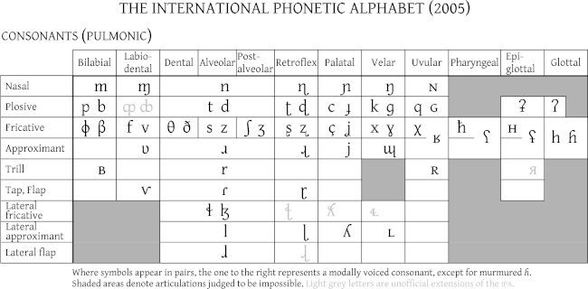

# Phonetics & phonology

Note: this section is draftier than the rest of this draft, in the sense that I never even re-read it.

## Some anatomy
We call _vocal tract_ what comprises the various parts of the body used to produce speech sounds. It is interesting to notice that each of these body parts has its own biological function and its adaptation for speaking is only secondary, so there is no such thing as "the organ of speech". 

### Tools
- Autopsy (oh well...)
- X-rays (no tongue)
- sonography (technique used for _in utero_ images)
- MRI (Magnetic Resonance Imaging)

## Phonetics

> __Phonetics__ = the study of speech sounds from a _physical_ (not functional) point of view. It deals with both the _production_ (speech apparatus) and the _perception_ (auditory apparatus) of speech sounds. It is __language independent__.

Only 2-300 sounds are needed to represents _all_ sounds in _all_ the 5000-8000 different languages across the world, and each language only selects a part of them (no more than 50).

### Main subfields and methodologies

| Subfield                   | Object                           | Experimental methods                                         |
| -------------------------- | -------------------------------- | ------------------------------------------------------------ |
| __articulatory__ phonetics | speech production, speaker       | electropalatography, x-rays, ultrasounds, physiological measurements of nasal and oral flow |
| __acoustic__ phonetics     | speech acoustic, physical medium | waveform, spectrogram, spectra, intensity curves and pitch tracks analysis |
| __perceptual__ phonetics   | perception, hearer               | eye tracking (for reading), identification & discrimination experiments with auditory stimuli |

Other methods: qualitative studies, corpora-based studies.

### Sound classification

Sounds are classified based on the following aspects.

#### Initiation

- __airstream mechanism__:

  | Mechanism name | Source of energy |
  | -------------- | ---------------- |
  | **pulmonic**   | lungs            |
  | **glottalic**  | glottis          |
  | **velaric**    | tongue           |

- _airflow direction__:

  - egressive
  - ingressive (e.g. that weird sound that Swedes sometimes make instead of just saying “ja”)

Inexhaustive classification based on initiation:

| Sound type    | Characteristics      |
| ------------- | -------------------- |
| __ejective__  | glottalic egressive  |
| __implosive__ | glottalic ingressive |
| __click__     | velaric ingressive   |

#### Phonation

Larynx (voice box) and vocal folds.

Classification of consonants based on phonation (not valid for all languages):

- voiced (e.g. [f]) - vocal cords vibrate
- voiceless (e.g. [v]) - vocal cords do not vibrate

#### Articulation

- _place_ of articulation:

  - oral

  - nasal

  - active (i.e. moving) articulators: lower lip, tongue

  - passive articulators: upper lip and teeth, upper oral cavity, back wall of the pharynx...

    ##### Classification of some consonants based on phonation and articulation

    | Group             | Consonant (IPA) | Phonation | Oral/nasal | Articulators                                                 |
    | ----------------- | --------------- | --------- | ---------- | ------------------------------------------------------------ |
    | **bilabial**      | [p]             | voiceless | oral       | the two lips (closed)                                        |
    | **bilabial**      | [m]             | voiced    | nasal      | the two lips (closed)                                        |
    | **labiodental**   | [v]             | voiced    | oral       | active: lower lip; passive: upper teeth                      |
    | **dental**        | [θ]             | voiceless | oral       | active: tongue blade or tip; passive: upper teeth            |
    | **alveolar**      | [t]             | voiceless | oral       | active: tongue blade or tip; passive: alveolar ridge         |
    | **post-alveolar** | [ʃ]             | voiceless | oral       | active: tongue blade or tip; passive: area behind the alveolar ridge |
    | **palatal**       | [c]             | voiceless | oral       | active: middle or back part of the tongue; passive: hard palate |
    | **velar**         | [k]             | voiced    | oral       | active: back part of the tongue; passive: soft palate        |
    | **uvular**        | [χ]             | voiced    | oral       | active: back part of the tongue; passive: uvula              |
    | **pharyngeal**    | [ħ]             | voiceless | oral       | active: root of the tongue; passive: pharynx                 |
    | **glottal**       | [h]             | voiceless | oral       | glottis                                                      |

- _degree_ of stricture:

  - open approximation: resonants
  - close approximation: fricatives
  - complete closure: stops

- _aspect_ of articulation

  - _conformational_:
    - oral VS nasal (again?)
    - central VS lateral (another way to distinguish between resonants and fricatives)
  - _topographical_ (tongue surface convex/concave):
    - grooved (fricatives)
    1. retroflex (stops, fricatives and resonants)
    2. cupped (stops, fricatives and resonants)
    3. withdrawn tongue root (resonants)
    4. extension of the tongue tip (stops, fricatives, and resonants)
    5. advancement of the tongue root (ATR) (stops, fricatives and
    resonants)
  - _transitional_ (steady/dynamic):
    1. flapped (stops, fricatives and resonants)
    2. tapped (stops and fricatives)
    3. trilled (stops and fricatives)
    4. diphthongal (resonants)
    5. triphthongal (resonants)

#### Co-ordination

Co-ordination is represented via diacritics (not listed here) in the IPA.

- __devoicing__ (partial, initial or final)
- __release__ 
- __plosion__ (oral, nasal, central, lateral)
- __aspiration__
- __affrication__ (stop + fricative)
- __length__

## Prosody

Stress, pitch accent, intonation...

## The International Phonetic Alphabet

### Consonants in the IPA

### Vowels in the IPA

Vowels in the IPA are categorised based on:

- **height** (close/open, referred to the position of the tongue)
- **location** (front/central/back)
- **lip position** (spread/neutral/rounded)

Where symbols appear in pairs, the one to the right represents a rounded vowel.

Other characteristics of vowel sounds:

- length
- nasalization

#### Diphthongs

> A **diphthong** is made of two adjacent vowels in the same syllables. The two vowels usually have different _quality_.

Types of diphthongs:

- _falling_ or _descending_ (the vowel with higher prominence comes first) VS _rising_ or _ascending_ (the vowel with lower prominence comes first)
- _closing_ (the more open vowel comes first) VS _opening_ (the more closed vowel comes first)
- _centering_ (the second vowel quality is more central)

### Acoustics

Inexhaustive list of mentioned things:

- plosives/stops (again)
- fricatives (again)
- affricates (again)
- trills
- flaps
- taps
- nasals (again)
- approximants (= glides)
- laterals & rhotics (= liquids)

## Phonology

> __Phonology__ = study of the systematic, __language dependent__ aspects of sounds, like their distinctive functions.

### Phonemes and allophones

> __Phoneme__ = minimal sound unit distinguishing meaning in a certain language. Not meaningful by itself.

An _allophone_ is a variant of an phoneme that does not change the meaning (cf. “è” and “é” in southern Italy) _substitution test_, two words form a _minimal pair_ if they only differ by one phoneme

### Phonotactics

Phonotactics is a part of phonology which treats how different phonemes can be combined in a certain language (example: how many consonants can you have in a row?).

## Transcriptions

Do not confuse **phonetic transcriptions** (enclosed in [...] and very close to the “actual pronunciation”) with **_phonemic_ transcriptions** (more abstract and phoneme based, enclosed in /.../).

On top of this, there are _**graphemes**_, i.e. alphabetic characters of the various writing systems, sometimes enclosed in <...>. The study of the different writing systems is called _graphonomics_.

