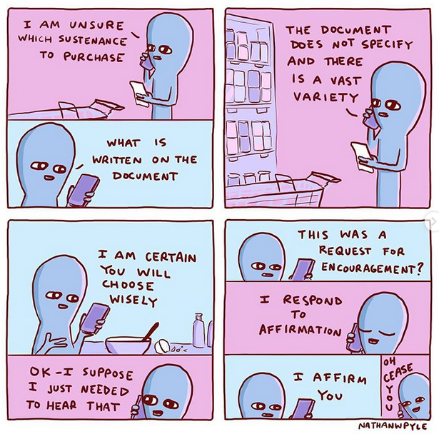

# Semantics

> Semantics is the study of linguistic meaning and interpretation of linguistic expressions.

It has to do with syntax, morphology and pragmatics.

## Some key concepts

### Utterance VS sentence

> __Utterance__ = unrepeatable speech/writing event that happens at a particular point in time, speech or writing event intended as a physical event.

> __Sentence__ = linguist’s abstraction from an utterance

This distinction is fundamental, as language is always produced in context, and this context affects meaning. As an example, think of how the meaning of the sentence “I’d like a glass of water” varies if produced in a restaurant (command) or during a hike (desire).

### Intension VS extension (Carnap)

> __Intension__: similar to the meaning one can find in a dictionary, it is the set of properties that allow to specify which objects belong to a certain _extension_

> __Extension__: set of real world objects a word can refer to.

### Sense VS reference (Frege)

> __Sense__: the thought that a sentence expresses, the mental image corresponding to a sentence (cf. _significante_, intension)

> __Reference/referent__: truth value or denoted set (cf. _significato_, extension)

My personal thought is that these definitions are extremely unclear. The concept is better (but not that much better) understood by example:

- “The evening star”:
  - sense: the concept of a star that appears first in the evening
  - reference: Venus
- “Is Italian”:
  - sense: the concept of being Italian
  - reference: a set of all individuals who are Italian
- “Pavarotti is Italian”:
  - sense: the thought/proposition that Pavarotti is Italian
  - reference: True

### But what does _meaning_ even mean?

So far, the key concept of _meaning_ (which is after all the object of semantics). About this there are two types of theories:

- **referential theories**, where meaning is what links linguistic expressions and real-words objects, events, situations (cfr. extension, reference). Theories of this kind lead to **truth conditional semantics**:
  - advantages: provide an explanation of what meaning is - language corresponds to real-world situations
  - drawbacks: semantics of hypothetical situations, all true propositions just mean “True”
- **cognitive theories**, where meaning is the link between linguistic expressions and human mental constructs (cfr. intension, sense)
  - advantages: allow to talk about hypothetical situations and to communicate our internal experience
  - disadvantage: non rigorous, informal way to describe mental structures etc.
- **pragmatic theories**, where meaning is determined by social interactions and things we "do" by using language (e.g. making promises) 

## Compositional semantics

_Compositional_ semantics deals with meaning of well formed _sentences_ (not the same as pragmatics where the “well formed” part is not that important). More precise distinction: same as competence VS performance, even though there is a strong relationship between the two. 

The __principle of compositionality__ is the following:

> The meaning of a complex expression is determined by the meanings of its constituent expressions and the rules used to combine them

## Lexical relations between words

We define meanings in terms of other words, e.g.:

- Spaniel: type of _dog_ (hyponymy, there is also hyperonymy)
- Dark: opposite of _light_ (antonymy)
- Honest: same as _truthful_ (synonymy)

In the next few sections, we will examine these and some more possible relationships.

### Synonymy

> Two words are _synonyms_ if their meanings are closely related.

Synonyms don’t necessarily have the same stylistic value. 

Also, two words can be synonyms in one context but not another (which is troublesome in machine translation).

### Antonymy

> Two words with opposite meaning are called antonyms.

Some words are gradable, so, so to say “double negation does not hold” (in a way). The non-gradable ones have no comparatives.

- _reversives_ (doing and undoing of something: open-close, pack-unpack)
- _converses_ (same event from different perspectives: over-under, parent-child)

### Hyponymy - hyperonymy

> Inclusion relationship

Waltzing $\subset$ dancing $\subset$ moving

### Homophony

> Two words with the same pronunciation

### Homonymy

> Identical words with different unrelated meanings

Examples: pupil, space, bank

### Polysemy

> Words with the same form and related meanings

Example:

- Head of a person/of a company

Often result of metaphorical language.

### Metonymy

Based on closeness & relatedness in a Context.

Example: “ha finito la bottiglia” (l’acqua nella bottiglia), “non ci sono notizie da Palazzo Chigi” (dal governo), “Legni non suonate” (strumenti di legno).

## Semantic features

Words can be described in terms of the qualities essential to their referents. Such qualities can be combined with syntax rules to form a grammar so not to form sentences like: “the carpet ate a sandwich” (this may or may not be a good idea).

Example: animate/inanimate, gender...

## Prototypes

Another way to describe meaning is to do so via prototypes.

> A _prototype_ is a “central member” of a semantic field.

This is very intuitive and very dangerous: for example, what’s the prototype of a human?

## Thematic roles (aka $\theta$-roles)

Finally, meaning can be described via thematic roles, that focus on the relations between parts of speech. Here are some of the most important _roles_:

- __agent__: it initiates an action, usually consciously. Example: “_the dog_ chased the cat”
- __theme__: an entity which is affected by an action or described, typically non-human. Examples: “_The ball_ was blue”, “Sam threw _the ball_” 
- __patient__: very similar to and not always distinguished from theme, its state changes. Example: “She closed _the window_”
- __instrument__: entity used to do something. Example: “He signed the contract with _a quill_”
- __experiencer__: someone who knows/feels something. Example: “_I_ felt sad”.

## Formal semantics

### Timeline

1. 60s, UCLA: R. Montague, philosopher, starts applying formal logic to semantics (Montague grammar, Montague semantics). B. Partee, linguist, introduces this approach to linguists
2. 70s and 80s: FS becomes a well established research area
3. 90s and beyond: P. Blackburn and J. Bos develop various computational approaches to the subject

### Denotation

Names and noun phrases _denote_ ad denotation, denotatum, reference or semantic value (these are all synonims).

Example: “Marco Aurelio” denotes a certain person named like this.

It can be quantified (cf. first order logic quantifiers); in that case the interaction with negation is sometimes interesting (e.g. in Italian). To study denotation we can also use truth tables.

### Inference

We can model _entailment_ like in formal logic. For example, from “The Queen of the UK is wearing a hat” follows “Someone is wearing a hat” (but also: “The UK is a monarchy” - which is a _presupposition_ - and so on).

#### Types of presupposition

- **Existential**: “The Queen of the UK is wearing a hat” <- “There exists a Queen of England”
- **Aspectual**: “I just stopped reading” <- “I have been reading”
- **Iterative**: “He returned to Cambridge” <- “He had been in Cambridge before” or “He said no again” <- “He already had said no”
- **Implicative**: “Kokoro Fuji managed to top the boulder” <- “He was trying to top the boulder”

#### Conversational implicature

Pseudo-inference from inexact/incomplete information. Example: “Are you planning to be at school for lunch?” “I have to go to class in the morning and then I have a meeting at 2:30 pm” “_See you in the canteen, then_”.
