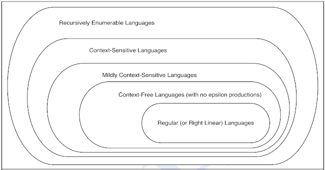
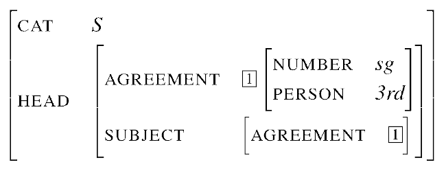
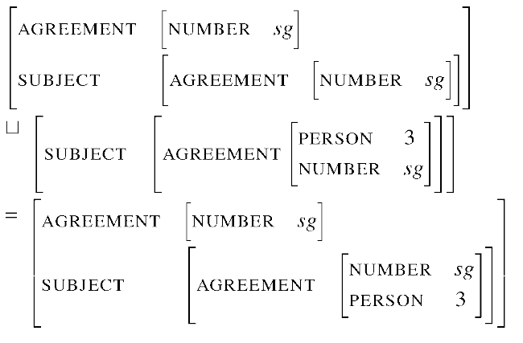
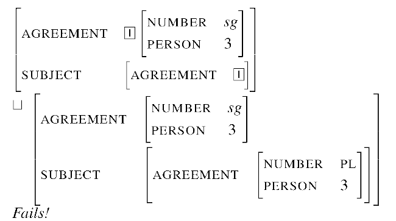

# Syntax

> __Syntax__ is the study of the structure of sentences, i.e. of the principles, _both universal and language specific_, that govern how words are assembled to yield grammatical
> sentences.

This means that syntax operates on the level of words (or higher) and that its product is a grammar (i.e. a set of rules that approximate human linguistic intuition, i.e. their _linguistic competence_, valid strings in a language - formal syntax does so formally, using formal grammars and/or other formalisms), where rules are abstracted from linguistic evidence (__human *performance*__).

Even if (most linguist think that) natural languages are not formal, formal syntax is still an useful tool to analyse them.

## Formal (generative) grammars (Chomsky) 

Main principles:

- formality
- aim to be a theory of human linguistic ability (discussable!). Assumptions:
  - there exists universal grammar (UG) innate to humans. Variations between languages are parameters set during language acquisition
  - syntactic processes are central in human language production & understanding and in reasoning

> A _formal grammar_ is a 4-uple $(\Sigma, N, P, S)$ where
>
> - $\Sigma$ is a finite set of __terminal symbols__ (denoted by small latin letters + $\epsilon$, the empty string)
> - $N$ is a finite set of __non-terminal__ (aka __variable__) __symbols__ (denoted by capital latin letters)
> - $P$ is a finite set of __production rules__ in the form $left \to right$, where both $left$ and $right$ are sequences of elements belonging to the two sets above
> - $S \in N$ is a __start symbol__

Conventions:

- capital latin letters denote variables
- small latin letters denote strings of terminals
- small greek letters denote strings in $(\Sigma \cup N)*$

In the context of FGs, language are defined via __derivation__, which consists in starting from $S$ and applying rules by replacing symbols on their $left$ sides with symbols on the respective $right$ sides, stopping when there are no more variables. More precisely

> A string _derives_ (resp. _directly derives_) another one if it can be rewritten as the second one via some series of rule applications (resp. via one rule application). 

### Normal forms
It is sometimes useful to have a normal form for grammars.
One such normal form is the __Chomsky Normal Form__. Its characteristics are:

1. $\epsilon$-free
2. productions in the forms:
  - $A \to BC$
  - $A \to a$

Note that 2 makes it so that parse trees are binary trees!
See LFC notes to know how to convert a grammar to its normal form.

### Chomsky hierarchy

Increasing the power of the production rules yields different “levels” of formal grammars (note: greek letters stand for something that is either a variable or a terminal):

| Grammar type | Language                               | Production rules allowed                 |
| ------------ | -------------------------------------- | ---------------------------------------- |
| 0            | recursively enumerable (nonrestrictive) | $\alpha \to \beta$                       |
| 1            | context sensitive                      | $\alpha A \beta \to \alpha \gamma \beta$ |
| -            | (mildly context sensitive)             |                                          |
| 2            | context free                           | $A \to \gamma$                           |
| 3            | regular                                | $A \to a$ and $A \to aB$                 |

#### Remark on MCSLs
 Mildly context sensitive grammars are a proper subset of context sensitive grammars and a proper superset of context free grammars.

#### Remarks on natural language
The fact that a language $L$ contains a subset $L'$ at "rank" $P'$ in the Chomsky hierarchy does _not_ imply that the language $L$ is also at rank $P'$. For instance, a language of type 3 can contain (as a proper subset) a language od type 2. This makes it harder to prove whether English can be modeled as a RL (the fact that we know that, say, agreement can be incorporated does not help), but there are proofs that this is not the case (based on counterexamples of the pumping lemma for RLs - see LFC notes).
As for whether English is context free, this is still object of discussion. All proofs saying the opposite but two, based on the pumping lemma for CFLs and cross-serial dependencies, have been proved incorrect already.

### Context free grammars

Formal definition:
> A CFG is a 4-uple $<N, \Sigma, P, S>$ where
> 
> - $N$ is a set of _nonterminal symbols_ or _variables_
> - $\Sigma$ is a set of _terminal symbols_ (note that these two sets are disjunct)
> - $R$ is a set of _rules_ or _productions_ in the form $A \to \beta$, where $A \in N$ and $\beta$ is a string of symbols belonging to $(\Sigma \cup N)*$
> $S$ is a designated start symbol.

Properties:

- a phrase can be applied independently of its context (no context on the LHS of rules; this it what it means for a grammar to be context free)
- a phrase has its internal structure (RHS of rules)
- phrases cannot be discontinued nor overlap
- phrases are either disjoint or contain one another
- recursive application of rules is allowed (as in XP → Y XP)

#### Limitations and potential solutions

Properties that CFGs _do not_ have but that are required to be able to model language:

- phrases have heads (terminal symbols) that determine their category
- heads can be modified by other phrases (modifiers)
- selectional restrictions on constituents:
  - __agreement__ (which depends exactly on the context - person, number, tense, gender, quantifiers...)
  - __sub-categorization__ (note: the example in the slide is "Alex liked *(the park)"; I don't get why it should be incorrect)
- __arbitrary rules of specific languages__ (like mandatory subject: "_it_ rains")
- sentences have to have a sensible __meaning__: "*(The tree climbed up Alex)".

Potential solutions:

- As for __agreement__, it is possible to encode the agreement information in CFG rules (a solution which is in part similar to an annotating type checker)
- As for __sub-categorization__, we can take a general rule and split it into a set of more specific rules, so that we have one per predicate category (naive solution). For example, if we had a general rule for verb phrases, we could instead see verbs as predicates and generate different rules for:
  - verbs with no arguments ("rain")
  - verbs with an agent argument (aka intransitive verbs, e.g. "sneeze")
  - verbs with a theme argument (aka un-accusative verbs, e.g. "fall")
  - verbs with an agent and theme argument (aka transitive verbs, e.g. "kiss")
  - verbs with an agent, a theme and a goal argument (e.g. "give", as in "I gave a present to her")
  - verbs with an agent and a proposition argument (aka factive verbs, e.g. "say" as in "He said that he enjoyed the concert")
  - ... (cf. thematic roles in the chapter on Semantics)
- Make use of theta roles (see section on semantics) (?)
- Again for __sub-categorization__, we can take into account the core frame elements for communication:
  - communicator
  - medium
  - message
  - topic
  - addressee
  - amount of information
  - duration
  - frequency
  - ...

##### Feature structures

In general, when it comes to representing constraints, instead of introducing a whole lot of new rules we can use __*feature structures*__ (more precisely, we can represent each node of our grammar with a feature structure). They are essentially feature-value pairs (e.g. $<number,singular>$), where features are atomic symbols drawn from some finite set, and values are either atomic symbols or feature structures themselves (recursion).

Feature structures are usually represented as _attribute-value matrices_ (AVM):

This ability to use features structures as values for features leads to the notion of _feature path_: a sequence of features leading to a particular value. For instance, int the example above, the path "AGREEMENT PERSON" leads to "3rd". This suggests that a possible implementation of feature structures is via DAGs.

As shown in the example below, feature structures can be _reentrant_, meaning that two paths can lead to the same node/value/structure-as-value.

It is possible to perform operations on feature structures. One very important such operation is __*unification*__ $\sqcup$ (not entirely different from set union), useful both to merge the information contained in two (compatible) feature structure and to check whether they are compatible. Unification is so intuitive that we will not define it formally; two examples will suffice:

Remark: feature structures can be _typed_! 

## Words, aka terminal symbols, aka Parts Of Speech (POS)

How to affirm that there are different classes of words and how to then classify words? The _semantic criteria_ would not get us far, ending up in a long enumeration of possibilities (e.g. “a noun is a place, an object or a person”). On the other end, the __*distributional criteria*__ are more useful:

- __morphological distribution__: what kind of affixes can a word take?
  - inflectional
  - derivational
- __syntactic distribution__: what kind of words appear around a word?

### Types of POS

How many and what parts of speech there are depends on the language and the grammar we intend to build. Some common choices are:

- Nouns (divided into proper and common, countable and uncountable...)
- Verbs (divided into transitive, intransitive and ditransitive, but also, based on their function, into auxiliary, modal and main)
- Adjectives
- Adverbs;
  - directional and locative (place)
  - degree
  - manner
  - temporal
- Pronouns ans anaphora (e.g. itself)
- Qualifiers
  - Numerals
  - Determiners:
    - Articles
    - Demonstratives
    - Possessives
    - Quantifiers
- Prepositions
- Conjunctions
- Particles

But also:

- Complementizers (e.g. that, for, if...)
- Negations

For representing subcategories, one may use _features_ (syntax: ±feature).

Finer - but not excessively fine - distinctions (e.g. tenses for verbs), aka features in theoretical grammars, can be found in the Penn Treebank tagset.

## Phrases, aka non-terminal symbols
Words associate with certain other words and form units. In order to find the constituents of a sentence, we can make use of several __tests for constituency__:

- replacement: try to replace a unit with a similar one
- sentence fragment:
- coordination: try to conjoin units
- displacement.

### Phrase structure
We can represent the hierarchical structure of sentences via bracketing or trees.

## Typology
Languages can also be classified in terms of their syntax.
One way to do so is to consider (the most common) word ordering, focusing on Subject, Verb and Object. The most commonly found orderings are:

1. SVO (Italian, English, Spanish... all of the languages I speak excepts Swedish whenever the sentence starts with something other than the subject)
2. SOV (e.g. Japanese)
3. VSO (e.g. Gaelic)
4. VOS (e.g. Malagasy)

