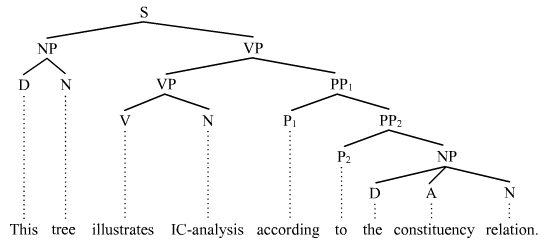
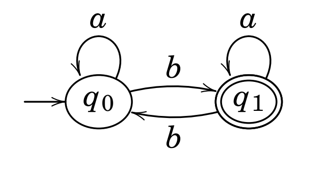
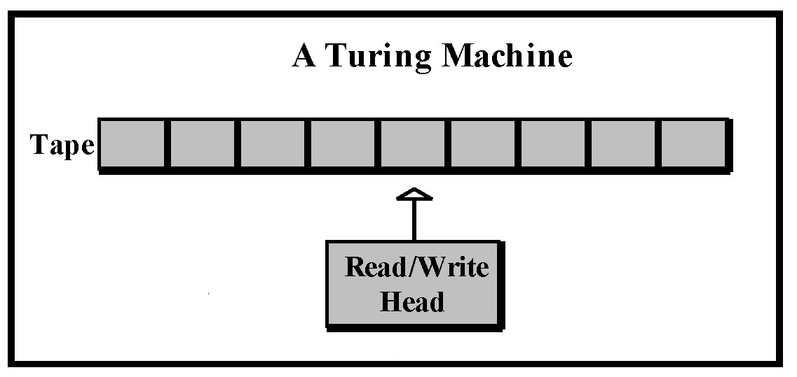
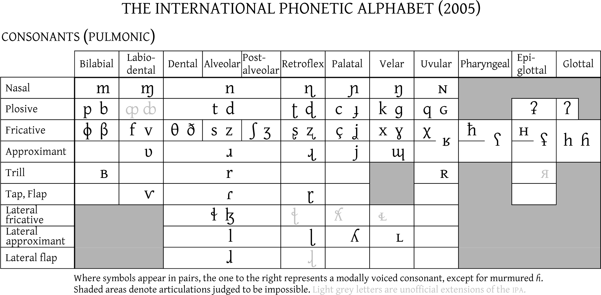
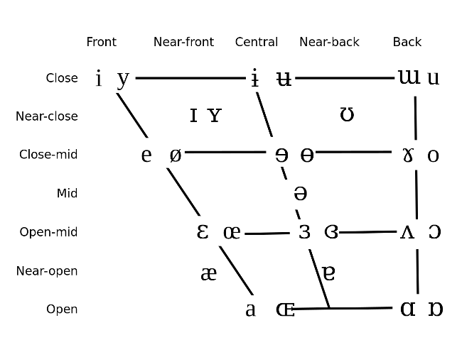
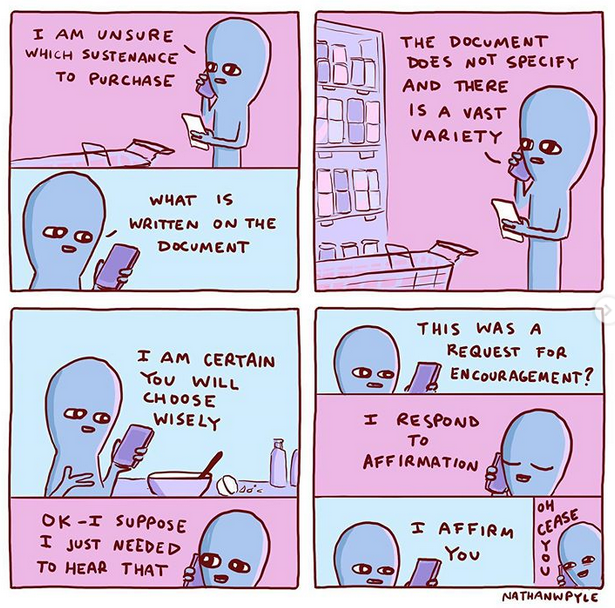

% Formal-to-some-extent notes
% Arianna Masciolini

###### tags: `uni`

# Introduction to Formal Linguistics

FL is only formal to some extent - not as a binary notion. This is due to the fact that the object of study is natural language, which is ambiguous. There are, then, various "levels of formality”.

## Timeline
Precursors: 

- Pāṇini (Sanskrit philologist, IV century BCE)
- various Greek philosophers
- XIX century: 
  - historical & diachronic perspective
  - Hermann Paul: compositionality (sentences are the sum of their parts, not quite true but useful)
  - XX century: Saussure -> ~~Synchronic~~ (...)
- Pioneer: __Noam Chomsky__ (mid 50s) - principal contributions:
  - Syntactic structures (using mathematical tools in language analysis)
  - Chomsky hierarchy
  
## Methodologies

- _Corpus_ linguistics (= study of language as expressed in _corpora_ of "real world" text. If collected in natural context (_realia_), effectiveness improves)
- formal analysis
- experimental methods (a wide variety)
- ethno-methodology (= conversation analysis, i.e. just observe language in context, used in anthropology)

## Subfields

Main subfields:

- **Phonetics** (deals with the _production of speech sounds_)
  - articulatory -> IPA chart (phonetic alphabet)
  - acoustic (physics side of things)
- **Phonology** (is about _patterns of sounds conveying a meaning_): phonemes, phonological rules
- **Morphology**: the study of the different forms words have, the boundary with syntax is not clear (cf. compounding in German and Swedish)
  - inflectional: about different forms in a paradigm, singular VS plural, feminine vs masculine...
  - derivational: about how to create new words from existing ones (possibly in another category, e.g. nouns from adjectives)
- **Syntax/Grammar**: set of (formally expressed, assuming that natural language is context free) structural rules governing the composition of clauses, phrases and words
- **Semantics**: the study of meaning. It makes use of propositional & first order logic, model theory (somehow closely related to set theory) and inference (formal and pragmatic, i.e. common sense inference)
- **Pragmatics**: study of language _in use_ (difference between what we say & what we communicate, dynamic meaning)
- **Lexicon**: inventories of words (+ idioms)

Secondary subfields:

- historical linguistics
- comparative linguistics & typology
- (...)

## The origins of language

There is a lot of speculation on the origin of language (but not a definitive explanation) - possible sources:

- __divine__ (cf. Genesis & Hindu traditions) -> numerous vain attempts to rediscover the (only) original divine language (before Babel)
- __natural sounds__:
  - “bow-wow” theory (based on onomatopoeia): does not explain words for silent objects or abstract concepts, assumes that language is only a list of names for things
  - “pooh-pooh” theory (based on instinctive sounds people make in emotional circumstances): these sounds are emitted in a way which differs significantly from speech (when we inhale, not when we exhale)
- __social interaction__ -> “yo-he-ho” (= “oh issa!”) theory (sounds used to coordinate a physical effort) (good idea, but still, what is the source of these sounds?)
- __physical adaptation__ (evolution of teeth, lips, tongue, larynx, pharynx and so on)
- __tool making__ (based on the fact that the areas of the brain and brain activity involved in complex vocalisation and tool making are remarkably similar)
- __genetic__ (__innateness hypothesis__)

## Computational linguistics 

Many names for basically the same thing: 

> Computational linguistics : Linguistics = NLP : CS = speech recognition : electrical engineering	= computational psycholinguistics : psychology

Natural Language Processing differs from other data processing tasks because it requires knowledge of language. One of the main problems is the ambiguity of natural language -> lexical and semantic disambiguation, probabilistic parsing.

### Tasks

The objective of NLP is to make computers perform tasks involving natural language, e.g.:

- improving human-human communication
  - machine translation
- enabling human-computer communication
  - dialogue systems (aka conversational agents)
  - web-based question answering ("solved" for yes/no and factoid questions)
- performing text and/or speech processing
  - TTS (Text To Speech)
  - STT (Speech To text)
  - grammar & spell checking

### Tools

- State machines
- rule systems
- probabilistic models & machine learning
- vector-space models
- predicate & first-order logic
- classic search algorithms such as depth & breadth first search and A* search

### Chronology

- 1936: automata (Turing)
- 1943: McCulloch-Pitts neuron
- 1950: Turing test, first speech recognition systems (Bell Labs)
- 1956: CFG (Chomsky) and other formal language theory
- 1957-60: division into symbolic (formal languages + “classic” AI by McCarthy, Minsky etc.) & stochastic paradigm
  - 1966: ELIZA (Emacs’ doctor)
  - Logic Theorist (theorem prover)
  - first online corpora
- 1970s-90s: ulterior subdivision into four fields:
  - stochastic paradigm
  - logic-based paradigm -> logic programming
  - natural language understanding (1972: SHRDLU)
  - discourse modelling
- 2000+: rise of machine learning 

# Morphology

> __Morphology__ = the study of __words__: what they are, how they are formed and their different forms

In language technology, it is involved in:

- analysis: parsing, speech recognition, machine translation
- generation: language generation, machine translation

It's important to notice that it is even nontrivial to define what a word is, unless we only take _orthographic_ (i.e. separated by spaces when spelt) words into account (but even in that case, what about "tea-bag" and "I'll"?).

## Leading figures

1.  Pāṇini (India, IV century BCE), Greek and Arabic authors
2.  De Saussure (Switzerland, late XIX and early XX century)
3.  Bloomfield (USA, early XX century)
4.  Roman Jakobsson (Prague school, Czech Republic, first half of the XX century)

## Essential vocabulary

- _Lexeme_ = abstract lexical entity consisting of __form + meaning__. It represents a
  set of forms (note: this is according to the slides. I actually think that a better definition would be: “__basic unit of a language with *lexical meaning*__ consisting of one or several words, the elements of which do not separately convey the (lexical) meaning of the whole”)
  
- _Root_ = basic part of a lexeme not further analyzable either in terms of inflectional or derivational morphology, always present in every form (note: compounds have two roots)

- _Stem_ = a root or a root + a derivational morpheme changing its meaning (example: “deduce” is a stem but not a root, as it can be analysed in terms of “de” + “duce”)

- _Lemma_ = basic form that represents the word e.g. in a dictionary (even though I cannot unsee that this is exactly how Bauer defines lexemes...)

- _Word form_ or _orthographic word_ = a certain form of a certain lemma (e.g. the feminine form of an adjective in Italian, the _bestämd_ form of a Swedish word or the past simple of an English verb)

- _Grammatical word_ = words defined in terms of their place in the paradigm, described for instance as "the past simple of verb X"

- _String_ = sequence of characters

- _Morpheme_ = smallest meaningful unit (of a word). By _meaningful_, we refer both to lexical and grammatical (see below), e.g. the word “unfair” is composed of two morphemes (“un” + “fair”). According to Bauer, this is actually how you define _morphs_, but as we will see later most sources agree on the fact that a morph is, instead, the _phonetic_ realization of that morpheme. They are divided into:
  - _free_ (standalone) morphemes
  - _bound_ morphemes (the _base_ of a word is the part to which bound morphemes are attached): 
    - _roots_
    - _affixes_: (prefixes, suffixes, infixes, circumfixes)
    - _clitics_: depend on other words, their host word can belong to several classes of words. Example: “the”, “a”
  
  Can also be divided into:
  
  - _lexical_
  - _grammatical_ (with one ore more meanings attached at the same time, cf. verb suffixes in Spanish ans Italian. In this latter case they are called _portmanteau morphemes_)
  
- _Morph_ = A phonetic (and sometimes orthographic) representation of a morpheme. Different morphemes associated with the same meaning (in complementary distribution) are called _allomorphs_. Examples:
  - the plural of the Swedish word “**fågel**” is “**fågl**ar”. “Fågel” and “fågl” are then allomorphs
  - “-s” and “-es” are allomorphs of the English plural morpheme
  - the English articles "a" and "an" are allomorphs

## Content VS function words

- _Content words_: __words with a clear *lexical meaning*__ (nouns, verbs, adjectives. Note that these classes of words all are _open classes_, i.e. it is possible to add them new words)
- _Function words_ : __words__ with no clear lexical meaning, __which__ instead __specify *grammatical functions* and relationships__ (conjunctions, prepositions, articles, pronouns. Note how they are all [almost: cf. “hen” in Swedish!] _closed classes_)

The brain treats content and functions words differently! In fact:

- Some aphasics are unable to read function words like “in” or “which”, but can read the lexical words “inn” and “witch”
- In early stages of development children often omit function words

## Word formation (morphological) processes

- _Coining_ (making up new terms)
- _Loan_ from other languages: andante, oxymoron...
- _Calque_ or _loan translation_: e-post, skyskrapa, scannerizzare, balonvolea...
- _Acronym_: ISA (Instruction Set Architecture), FLOSS (Free, Libre and Open Source)...
- _Clipping_ (word shortening): math, fax, phone...
- _Blending_ of the first part of the word with the ending part of another: brunch, smog, bankomat
- _Compounding_ (putting together 2+ lexemes that could function as independent words): geburtstagsgeschenk and many more examples in German and Swedish
- _Derivation_ (__turning a word into another word__, it often happens via _derivational affixes_ such as “-ism”) 
- _Inflection_ (__creation of a new word *form*__)
- ...

### Derivation vs inflection

|                                                | __Inflection__                           | __Derivation__ |
| ---------------------------------------------- | ---------------------------------------- | -------------- |
| creates a new part of speech (change of class) | rarely                                   | often          |
| creates a new lexeme                           | yes                                      | no             |
| changes in meaning (?)                         | significant                              | modification   |
| semantic effect                                | sometimes hard to predict: odjur, oväder | predictable    |

## Morpheme analysis

1. Structure the word forms
2. compare two forms which are as similar as possible and identify their common-and-not features (morphs/morphemes)
3. check what role the morphs that have been isolated have in other forms
4. check that the isolated morphs are in fact morphs in that they are “minimum”  

## Word classes
Traditional (classical) grammar attempts to classify words based on their function. More on that in the section about syntax, especially under "Types of POS".

## Typology (based on morphology)

Languages are grouped into categories based on morphology:

- **analytic**: one word, one morpheme, one meaning component (Chinese, English to a certain extent)

- **agglutinating**: one meaning per morpheme, words composed of several morphemes: (Turkish)
- **synthetic**
  - **inflectional**: several meanings per morpheme (Latin, Greek, English)	
  - **poly-synthetic**: a single word is possibly a sentence (Icelandic)
  - **non-concatenative**: base made of consonants, vowels infixed (Arabic, Hebrew)

## Typical morphology “problems”

- Where to split words? (“hoppa-r” or “hopp-ar”)
- what if there are multiple stems? (“vado”, “andare”)
- function or content? (“stor-het” vs “stor-lek”)
- what if identical morphs of the same lexeme indicate different morphemes? (e.g. Swedish adjectives terminate in ”-a” both in singular bestämd form and in plural obestämd form)

## Relationship with other subfields of linguistics

### Morphology

#### Morphosyntax
It’s often useful to talk about morphology and syntax together (__*morphosyntax*__) because some things are expressed morphologically in a language and syntactically in another. 

#### Grammar
One could also argue that syntax and morphology are so closely related that they should not be distinguished one from the other. Assuming this, we shall talk instead of __*grammar*__ (i.e. syntax + morphology). Traditional (classical) grammar tends adopt a _prescriptive_ approach. Nowadays, however a descriptive approach is preferred, based on the analysis of collections of real-world language samples. 

##### Structural analysis
One of the methods applied by those who follow a descriptive approach is called _structural analysis_. It investigates the distribution of forms in a language by checking what forms can fit certain "test frames". Example:
- Test frame: "The ___ makes a lot of noise"
- Possible fits: "car", "child", "dog", "radio"...
- Possible analysis: the possible fits all belong to the same grammatical category (Noun. But then wat about "Sam" and "A car"? (Noun Phrase) It's interesting to notice that pro-nouns are actually pro-nounphrases!)

##### Constituent analysis
This (descriptive) technique is designed to show how small constituents form larger constructs. To a computer scientist, it really looks like building the AST of natural language sentences.

Using this kind of diagrams helps us understanding the types of form that can be substituted for each other at different levels, but also, at a higher level, to work out the grammatical functions of phrases (for instance, in the diagram above "This tree" is a Noun Phrase whose role is to be the subject).

### Lexicon

Lexicon should perhaps be considered alongside morphology and syntax. We shall define lexicon later on, but for now let’s just say that according to one possible (and rather broad) its “units”, called _lexical entries_ are idealized mental constructs such as the syntactic pattern “PREPOSITION + NOUN PHRASE” in English.

## Computational morphology

### Formal languages

> A _formal language_ is a set of strings, each composed of symbols from a finite set of symbols referred to as _alphabet_.

### Regular languages

A formal definition of regular languages:

- $\empty$ is a RL
- $\forall a \in \Sigma \cup \epsilon, {a}$ is a RL
- if $L_1$ and $L_2$ are RLs, then so are
  - $L_1 \cdot L_2 = {xy | x \in L_1, y \in L_2}$ (_concatenation_)
  - $L_1 \cup L_2$ (_union_ or _disjunction_)
  - $L_1*$ (and $L_2*$) (_Kleene closure_)

Regular languages are also closed under the following operations:
- intersection $\cap$
- difference between languages $-$
- complementation between $\Sigma*$ and the language $-$
- reversal $^{R}$ 

### Regular expressions

> Regular expressions (regex) are an algebraic notation for characterizing sets of strings. 

They are made of _atomic symbols_ (lowercase Latin letters) and operations. The fundamental ones are:

- __concatenation__ (no symbol: two expressions one next to the other are concatenated)
- __Kleene closure__ (denoted by `*`)

There are also some more specific useful operators (there are actually various conventions though):

| Operator | Meaning                                                                |
| -------- | ---------------------------------------------------------------------- |
| `?`      | the preceding character or nothing                                     |
| `*`      | 0+ occurrences of the previous characters (well, this is just Kleene)  |
| `+`      | 1c occurrences of the previous character ("Kleene +")                  |
| `.`      | whatever single character                                              |
| `^`      | start of the line (e.g. `^the` matches lines starting with “the”)      |
| `$`      | end of the line                                                        |
| `\d`     | any digit                                                              |
| `\b`     | any digit                                                              |
| `\B`     | boundary between words                                                 |
| `\D`     | non-boundary between words                                             |
| `\w`     | any alphanumeric character                                             |
| `\W`     | any non-alphanumeric character                                         |
| `\s`     | whitespace                                                             |
| `\S`     | non-whitespace                                                         |
| `|`      | logical or (usage: like `^`)                                           |
| `()`     | precedence (e.g. `(y|ies)`)                                            | 

#### Brackets

Some examples to illustrate the usage of the `[]` operator:

| Example expression | Matched characters |
| ------------------ | ------------------ |
| [Aa]               | A, a               |
| [A-Z]              | A, ..., Z            |
| [0-9]              | 0, ..., 9            |
| [a-z]              | a, ..., z            |
| [0-9 A-Z]          | 0, ..., 9, a, ..., z   |

### Finite-state automata

FSA are _directed graphs_ where nodes represent *states* and arcs, labelled with symbols, represent transitions.

They can also be represented as _transition tables_ (see example below).

More formally (but only to some extent because we haven’t defined everything),

> A FSA is a 5-uple
> $$
> <Q, \Sigma, q_0, F, \delta>
> $$
> where:
>
> - $Q$ is the set of states
> - $\Sigma$ is the (finite) _alphabet_
> - $q_0$ is the _start state_
>
> - $F \subseteq Q$ is a set of _final states_ (aka _accept states_)
> - $\delta : Q \times \Sigma \to Q$ is a transition function between states

#### Example

- $Q = {q_0, q_1}$
- $\Sigma = {a,b}$
- $q_0 = q_0$ (oh well!)
- $F = {q_1}$
- transition function: $\delta(q,i) = {q_0 \to q_0, q_0 \to q_1, q_1 \to q_0, q_1 \to q_1}$

#### ε-transitions

A _nondeterministic_ FSA may have ε-transitions, i.e. transitions wirthout a corresponding symbol. NFAs with ε-transitions can effectively be converted to deterministic ones (DFAs). This means that they may be simpler to construct, but they are no more powerful than mere DFAs.

### Relationship between FSA, regular languages and regex

- regex _denote_ regular languages
- regex _compile into_ FSA
- FSA _accept_ (but also, from another point of view, _generate_)  regular languages

#### Recognition

> _Recognition_ is defined as:
>
> - the process of determining if a string should be accepted by an automaton
> - the process of determining if a string is in the language we’re defining with the automaton
> - the process of determining if a regular expression matches a string.

In _On computable numbers_ (A. Turing), recognition is described as the process of executing a tape divided into cells, using a read/write head (_Turing machine_). 

Such a machine is _universal_ for all unambiguous regular languages. This means that in order to change the behavior of the machine it suffices to change the tape (i.e. the program).

It works as follows:

1. Start from the initial state
2. Examine the current input (= read the symbol current cell)
3. Consult the _symbol table_
4. Go to a new state according to what the table says
5. ...
6. Until the tape ends

If, at any point in time, there is always only one thing to do, recognising is said to be _deterministic_ (simple table-driven interpreter. This concepts applies directly to automata as well, and given a NFA (where “N” stands for “Non-deterministic”) it is always possible to algorithmically construct an equivalent DFA (where “D” stands for “Deterministic”). There are, then, two main approaches to recognition:

- Convert a NFA to a DFA and use the latter to perform recognition (__deterministic recognition__)
- Explicitly manage recognition as a _state-space search_ (__non-deterministic recognition__), leaving the machine be a DFA. In __state-space search__, states are pairs $(pos, state)$, where $pos$ is the a tape position and $state$ is a state number, operators are compiled into the table and a goal state is a pair where the first element is the final tape position and the second element is a final state. Note that in a NFA there is at least a path from the initial state to a final state for each string in the language (finding such path means successful recognition!), but that doesn’t mean that all paths corresponding to that string end in a final state, so it is useful to have some backup strategy, such as marking choice points (**backtracking**). Other useful techniques are **look-ahead**, **parallelism**.

#### From regex to FSA (syntheses)

See “Sintesi” in LFC notes by Arturo Carpi.

### FST (Finite State Transducers)

A FST is a finite-state machine with _two_ memory tapes (an input tape and an output tape). It is, then, a generalization of a FSA, which is single-taped: a FSA defines a formal language by defining a set of accepted strings, while a FST defines _relations between sets of strings_, i.e. it __maps between two sets of symbols__.

In terms of graphs, the difference between FSA and FST is that in FST arcs are labelled with _pairs_ of symbols.

More formally,

> A FSA is a 7-uple
> $$
> <Q, \Sigma, \Delta, q_0, F, \delta, \sigma>
> $$
> where every element is defined as in FSAs excepts:
>
> - $\Sigma$ is the (finite) _input_ alphabet
> - $\Delta$ is the (finite) _output_ alphabet
> - $\delta : Q \times \Sigma * \to P(Q)$, where $|P(Q)| = 2^Q$, is the transition function that returns not a single state but a _set_ of states
> - $\sigma : Q \times \Sigma * \to P(\Delta)$, where $|P(Q)| = 2^Q$, is the _output function_, which gives the set of possible output strings for each state and input

Note that transducers as described above are nondeterministic. _Sequential_ transducers are their deterministic counterpart, but there is no general w'90
determinization algorithm, in contrast with FSAs.

Such a machine can be interpreted as:
- a __recognizer__, taking a pair of strings as input and output "accept" or "reject" depending on if the pair belongs to the string-pair language
- a __generator__ outputting pairs of strings of the language
- a __translator__ that takes a string as input and outputs another
- a __set relater__

Seen as a translator, it is useful to build _morphological parsers_. They require:

- a lexicon, i,e. a mapping between stems/affixes and basic information about them, for instance:
  - cat N
  - watch V
  - mouse N
- morphotactics, i.e. a model of morpheme ordering, for instance [un] + adjective + [er] as in clear, unclear, clearer
- orthographic rules, for instance inserting “e” before “s” in the third person of “watch”

#### Regular relations and regular expressions

While FSAs are isomorphic to regular languages (and regular expressions), FSTs are isomorphic to regulars _relations_), which are their natural extensions (instead of being sets of strings, of course, they are sets of pairs of strings).
They are closed under:
- union $\cup$
- inversion $T(T^{-1})$ (switching input and output; useful because it makes it easy to go from a "FST as translator" to a "FST as generator")
- composition $\circ$ (useful to replace two translators in series with a more complex one)

#### Relation to FSAs
The (resp. upper and lower) _projection_ of a FST is the FSA obtained by extracting only one side of the relation.

### Why finite-state computing?

- Computationally efficient for many NLP tasks:
  - tokenization
  - lemmatization
  - morphological analysis (morphological parsing, disambiguation)
  - inflectional & derivational morphology (example: nominalization of verbs)
- bidirectional (allows both analysis and synthesis)

# Phonetics & phonology

## Some anatomy
We call _vocal tract_ what comprises the various parts of the body used to produce speech sounds. It is interesting to notice that each of these body parts has its own biological function and its adaptation for speaking is only seconda, so there is no such thing as "the organ of speech". 

### Tools
- Autopsy (oh well...)
- X-rays (no tongue)
- sonography (technique used for _in utero_ images)
- MRI (Magnetic Resonance Imaging)

## Phonetics

> __Phonetics__ = the study of speech sounds from a _physical_ (not functional) point of view. It deals with both the _production_ (speech apparatus) and the _perception_ (auditory apparatus) of speech sounds. It is __language independent__.

Only 2-300 sounds are needed to represents _all_ sounds in _all_ the 5000-8000 different languages across the world, and each language only selects a part of them (no more than 50).

### Main subfields and methodologies

| Subfield                   | Object                           | Experimental methods                                         |
| -------------------------- | -------------------------------- | ------------------------------------------------------------ |
| __articulatory__ phonetics | speech production, speaker       | electropalatography, x-rays, ultrasounds, physiological measurements of nasal and oral flow |
| __acoustic__ phonetics     | speech acoustic, physical medium | waveform, spectrogram, spectra, intensity curves and pitch tracks analysis |
| __perceptual__ phonetics   | perception, hearer               | eye tracking (for reading), identification & discrimination experiments with auditory stimuli |

Other methods: qualitative studies, corpora-based studies.

### Sound classification

Sounds are classified based on the following aspects.

#### Initiation

- __airstream mechanism__:

  | Mechanism name | Source of energy |
  | -------------- | ---------------- |
  | **pulmonic**   | lungs            |
  | **glottalic**  | glottis          |
  | **velaric**    | tongue           |

- _airflow direction__:

  - egressive
  - ingressive (e.g. that weird sound that Swedes sometimes make instead of just saying “ja”)

Inexhaustive classification based on initiation:

| Sound type    | Characteristics      |
| ------------- | -------------------- |
| __ejective__  | glottalic egressive  |
| __implosive__ | glottalic ingressive |
| __click__     | velaric ingressive   |

#### Phonation

Larynx (voice box) and vocal folds.

Classification of consonants based on phonation (not valid for all languages):

- voiced (e.g. [f]) - vocal cords vibrate
- voiceless (e.g. [v]) - vocal cords do not vibrate

#### Articulation

- _place_ of articulation:

  - oral

  - nasal

  - active (i.e. moving) articulators: lower lip, tongue

  - passive articulators: upper lip and teeth, upper oral cavity, back wall of the pharynx...

    ##### Classification of some consonants based on phonation and articulation

    | Group             | Consonant (IPA) | Phonation | Oral/nasal | Articulators                                                 |
    | ----------------- | --------------- | --------- | ---------- | ------------------------------------------------------------ |
    | **bilabial**      | [p]             | voiceless | oral       | the two lips (closed)                                        |
    | **bilabial**      | [m]             | voiced    | nasal      | the two lips (closed)                                        |
    | **labiodental**   | [v]             | voiced    | oral       | active: lower lip; passive: upper teeth                      |
    | **dental**        | [θ]             | voiceless | oral       | active: tongue blade or tip; passive: upper teeth            |
    | **alveolar**      | [t]             | voiceless | oral       | active: tongue blade or tip; passive: alveolar ridge         |
    | **post-alveolar** | [ʃ]             | voiceless | oral       | active: tongue blade or tip; passive: area behind the alveolar ridge |
    | **palatal**       | [c]             | voiceless | oral       | active: middle or back part of the tongue; passive: hard palate |
    | **velar**         | [k]             | voiced    | oral       | active: back part of the tongue; passive: soft palate        |
    | **uvular**        | [χ]             | voiced    | oral       | active: back part of the tongue; passive: uvula              |
    | **pharyngeal**    | [ħ]             | voiceless | oral       | active: root of the tongue; passive: pharynx                 |
    | **glottal**       | [h]             | voiceless | oral       | glottis                                                      |

- _degree_ of stricture:

  - open approximation -> resonants
  - close approximation -> fricatives
  - complete closure -> stops

- _aspect_ of articulation

  - _conformational_:
    - oral VS nasal (again?)
    - central VS lateral (another way to distinguish between resonants and fricatives)
  - _topographical_ (tongue surface convex/concave):
    - grooved (fricatives)
    1. retroflex (stops, fricatives and resonants)
    2. cupped (stops, fricatives and resonants)
    3. withdrawn tongue root (resonants)
    4. extented of the tongue tip (stops, fricatives, and resonants)
    5. advancement of the tongue root (ATR) (stops, fricatives and
    resonants)
  - _transitional_ (steady/dynamic):
    - flapped (stops, fricatives and resonants)
    2. tapped (stops and fricatives)
    3. trilled (stops and fricatives)
    4. diphthongal (resonants)
    5. triphthongal (resonants)

#### Co-ordination

Co-ordination is represented via diacritics (not listed here) in the IPA.

- __devoicing__ (partial, initial or final)
- __release__ 
- __plosion__ (oral, nasal, central, lateral)
- __aspiration__
- __affrication__ (stop + fricative)
- __length__

## Prosody

Stress, pitch accent, intonation...

## The International Phonetic Alphabet

### Consonants in the IPA

### Vowels in the IPA

Vowels in the IPA are categorised based on:

- **height** (close/open, referred to the position of the tongue)
- **location** (front/central/back)
- lip position (spread/neutral/rounded)

Where symbols appear in pairs, the one to the right represents a rounded vowel.

Other characteristics of vowel sounds:

- length
- nasalisation

#### Diphthongs

> A **diphthong** is made of two adjacent vowels in the same syllables. The two vowelsusually have different _quality_.

Types of diphthongs:

- _falling_ or _descending_ (the vowel with higher prominence comes first) VS _rising_ or _ascending__ (the vowel with lower prominence comes first)
- _closing_ (the more open vowel comes first) VS _opening_ (the more closed vowel comes first)
- _centering_(the second vowel quality is more central)

### Acoustics

Inexhaustive list of mentioned things:

- plosives/stops (again)
- fricatives (again)
- affricates (again)
- trills
- flaps
- taps
- nasals (again)
- approximants (= glides)
- laterals & rhotics (= liquids)

## Phonology

> __Phonology__ = study of the systematic, __language dependent__ aspects of sounds, like their distinctive functions.

### Phonemes and allophones

> __Phoneme__ = minimal sound unit distinguishing meaning in a certain language. Not meaningful by itself.

An _allophone_ is a variant of an phoneme that does not change the meaning -> “è” and “é” in southern Italy -> _substitution test_, two words form a _minimal pair_ if they only differ by one phoneme

### Phonotactics

Phonotactics is a part of phonology which treats how different phonemes can be combined in a certain language (example: how many consonants can you have in a row?).

## Transcriptions

Do not confuse **phonetic transcriptions** (enclosed in [...] and very close to the “actual pronunciation”) with **_phonemic_ transcriptions** (more abstract and phoneme based, enclosed in /.../).

On top of this, there are _**graphemes**_, i.e. alphabetic characters of the various writing systems, sometimes enclosed in <...>. The study of the different writing systems is called _graphonomics_.

# Syntax

> __Syntax__ is the study of the structure of sentences, i.e. of the principles, _both universal and language specific_, that govern how words are assembled to yield grammatical
> sentences.

This means that syntax operates on the level of words (or higher) and that its product is a grammar (i.e. a set of rules that approximate human linguistic intuition, i.e. their _linguistic competence_, valid strings in a language - formal syntax does so formally, using formal grammars and/or other formalisms), where rules are abstracted from linguistic evidence (__human *performance*__).

Even if (most linguist think that) natural languages are not formal, formal syntax is still an useful tool to analyse them.

## Generative grammars (Chomsky) 

Main principles:

- formality
- aim to be a theory of human linguistic ability (discussable!). Assumptions:
  - there exists universal grammar (UG) innate to humans. Variations between languages are parameters set during language acquisition
  - syntactic processes are central in human language production & understanding and in reasoning

## Formal grammars

> A _formal grammar_ is a 4-uple $(\Sigma, N, P, S)$ where
>
> - $\Sigma$ is a finite set of __terminal symbols__ (denoted by small latin letters + $\epsilon$, the empty string)
> - $N$ is a finite set of __non-terminal__ (aka __variable__) __symbols__ (denoted by capital latin letters)
> - $P$ is a finite set of __production rules__ in the form $left \to right$, where both $left$ and $right$ are sequences of elements belonging to the two sets above
> - $S \in N$ is a __start symbol__

_Derivation_ consists in starting from $S$ and applying rules by replacing symbols on their $left$ sides with symbols on the respective $right$ sides, stopping when there are no more variables.

### Chomsky hierarchy

Increasing the power of the production rules yields different “levels” of formal grammars (note: greek letters stand for something that is either a variable or a terminal):

| Grammar type | Language                               | Production rules allowed                 |
| ------------ | -------------------------------------- | ---------------------------------------- |
| 0            | recursively enumerable (unrestrictive) | $\alpha \to \beta$                       |
| 1            | context sensitive                      | $\alpha A \beta \to \alpha \gamma \beta$ |
| 2            | context free                           | $A \to \gamma$                           |
| 3            | regular                                | $A \to a$ and $A \to aB$                 |

### Context free grammars
(Example rules: see slides 28-30.)

Properties of CFGs:
- a phrase can be applied independently of its context(no context on the LHS of rules; this it what it means for a grammar to be context free)
- a phrase has its internal structure (RHS of rules)
- phrases cannot be discontinued nor overlap
- phrases are either disjoint or contain one another
- recursive application of rules is allowed (as in XP → Y XP)

#### Limitations and potential solutions

Properties that CFGs _do not_ have but that are required to be able to model language:
- phrases have heads (terminal symbols) that determine their category
- heads can be modified by other phrases (modifiers)
- selectional restrictions on constituents:
  - __agreement__ (which depends exactly on the context - person, number, tense, gender, quantifiers...)
  - __sub-categorization__ (note: the example in the slide is "Alex liked *(the park)"; I don't get why it should be incorrect)
- __arbitrary rules of specific languages__ (like mandatory subject: "_it_ rains")
- sentences have to have a sensible __meaning__: "*(The tree climbed up Alex)".

Potential solutions:
- As for __agreement__, it is possible to encode the agreement information in CFG rules (a solution which is in part similar to an annotating type checker)
- As for __sub-categorization__, we can take a general rule and split it into a set of more specific rules, so that we have one per predicate category (naive solution). For example, if we had a general rule for verb phrases, we could instead see verbs as predicates and generate different rules for:
  - verbs with no arguments ("rain")
  - verbs with an agent argument (aka intransitive verbs, e.g. "sneeze")
  - verbs with a theme argument (aka un-accusative verbs, e.g. "fall")
  - verbs with an agent and theme argument (aka transitive verbs, e.g. "kiss")
  - verbs with an agent, a theme and a goal argument (e.g. "give", as in "I gave a present to her")
  - verbs with an agent and a proposition argument (aka factive verbs, e.g. "say" as in "He said that he enjoyed the concert")
  - ... (cf. thematic roles in the chapter on Semantics)
- Make use of theta roles (see section on semantics) (?)
- Again for __sub-categorization__, we can take into account the core frame elements for communication:
  - communicator
  - medium
  - message
  - topic
  - addressee
  - amount of information
  - duration
  - frequency
  - ...

##### Feature structures (unclear, note that in the example Cat stands for Category)

In general, when it comes to representing constraints, instead of introducing a whole lot of new rules we can use __*feature structures*__.

In particular, we represent each node of our CFG as a feature structure, to which we can add constraints. We can perform unification (⊔) on such feature structures (for a graphical - matrix - representation of such features, referred to as Attribute Value Matrix, see syntax 2 slides 26+).

#### Propagating features from heads (...)

## Words, aka terminal symbols, aka Parts Of Speech (POS)

How to affirm that there are different classes of words and how to then classify words? The _semantic criteria_ would not get us far, ending up in a long enumeration of possibilities (e.g. “a noun is a place, an object or a person”). On the other end, the __*distributional criteria*__ are more useful:

- __morphological distribution__: what kind of affixes can a word take?
  - inflectional
  - derivational
- __syntactic distribution__: what kind of words appear around a word?

### Types of POS

How many and what parts of speech there are depends on the language and the grammar we intend to build. Some common choices are:
- Nouns (divided into proper and common, countable and uncountable...)
- Verbs (divided into transitive, intransitive and ditransitive)
- Adjectives
- Adverbs
- Pronouns ans anaphora (e.g. itself)
- Determiners (e.g. articles and numerals)
- Prepositions
- Conjunctions

But also:
- Complementizers (e.g. that, for, if...)
- Negations
- Auxiliaries (is, do, have, to)
- Modal verbs (will, would, shall, should, can, could)

Finer distinctions (e.g. tenses for verbs), aka features in theoretical grammars, can be found in the Penn Treebank set.

## Phrases, aka non-terminal symbols
Words associate with certain other words and form units. In order to find the constituents of a sentence, we can make use of several __tests for constituency__:
- replacement: try to replace a unit with a similar one
- sentence fragment:
- coordination: try to conjoin units
- displacement.

### Phrase structure
We can represent the hierarchical structure of sentences via bracketing or trees.

## Typology
Languages can also be classified in terms of their syntax.
One way to do so is to consider (the most common) word ordering, focusing on Subject, Verb and Object. The most commonly found orderings are:

1. SVO (Italian, English, Spanish... all of the languages I speak excepts Swedish whenever the sentence starts with something other than the subject)
2. SOV (e.g. Japanese)
3. VSO (e.g. Gaelic)
4. VOS (e.g. Malagasy)

# Semantics

> Semantics is the study of linguistic meaning and interpretation of linguistic expressions.

It has to do with syntax, morphology and pragmatics.

## Some key concepts

### Utterance VS sentence

> __Utterance__ = unrepeatable speech/writing event that happens at a particular point in time, speech or writing event intended as a physical event.

> __Sentence__ = linguist’s abstraction from an utterance

This distinction is fundamental, as language is always produced in context, and this context affects meaning. As an example, think of how the meaning of the sentence “I’d like a glass of water” varies if produced in a restaurant (command) or during a hike (desire).

### Intention VS extension (Carnap)

> __Intention__: similar to the meaning one can find in a dictionary, it is the set of properties that allow to specify which objects belong to a certain _extension_

> __Extension__: set of real world objects a word can refer to.

### Sense VS reference (Frege)

> __Sense__: the thought that a sentence expresses

> __Reference/referent__: truth value or denoted set

My personal thought is that these definitions are extremely unclear. The concept is better (but not that much better) understood by example:

- “The evening star”:
  - sense: the concept of a star that appears first in the evening
  - reference: Venus
- “Is Italian”:
  - sense: the concept of being Italian
  - reference: a set of all individuals who are Italian
- “Pavarotti is Italian”:
  - sense: the thought/proposition that Pavarotti is Italian
  - reference: True

### But what does _meaning_ even mean?

So far, the key concept of _meaning_ (which is after all the object of semantics). About this there are two types of theories:

- **referential theories**, where meaning is what links linguistic expressions and real-words objects, events, situations (cfr. extension, reference). Theories of this kind lead to **truth conditional semantics**:
  - advantages: provide an explanation of what meaning is - language corresponds to real-world situations
  - drawbacks: semantics of hypothetical situations, all true propositions just mean “True”
- **cognitive theories**, where meaning is the link between linguistic expressions and human mental constructs (cfr. intension, sense)
  - advantages: allow to talk about hypothetical situations and to communicate our internal experience
  - disadvantage: non rigorous, informal way to describe mental structures etc.

## Compositional semantics

_Compositional_ semantics deals with meaning of well formed _sentences_ (not the same as pragmatics where the “well formed” part is not that important). More precise distinction: same as competence VS performance, even though there is a strong relationship between the two. 

The __principle of compositionality__ is the following:

> The meaning of a complex expression is determined by the meanings of its constituent expressions and the rules used to combine them

## Lexical relations between words

We define meanings in terms of other words, e.g.:

- Spaniel: type of _dog_ (hyponymy)
- Dark: opposite of _light_ (antonymy)
- Honest: same as _truthful_ (synonymy)
- Yellow: color, just like _green_ (hyponymy)

### Synonymy

> Two words are _synonyms_ if their meanings are closely related.

Synonyms don’t necessarily have the same stylistic value. 

Also, two words can be synonyms in one context but not another (which is troublesome in machine translation).

### Antonymy

> Two words with opposite meaning are called antonyms.

Some words are gradable, so, so to say “double negation does not hold” (in a way). The non-gradable ones have no comparatives.

- _reversives_ (doing and undoing of something: open-close, pack-unpack)
- _converses_ (same event from different perspectives: over-under, parent-child)

### Hyponymy - hyperonymy

> Inclusion relationship

Waltzing -> dancing -> moving

### Homophony

> Two words with the same pronunciation

### Homonymy

> Identical words with different unrelated meanings

Examples: pupil, space, bank

### Polysemy

> Words with the same form and related meanings

Example:

- Head of a person/of a company

Often result of metaphorical language.

### Metonymy

Based on closeness & relatedness in a Context.

Example: “ha finito la bottiglia” (l’acqua nella bottiglia), “non ci sono notizie da Palazzo Chigi” (dal governo), “Legni non suonate” (strumenti di legno).

## Semantic features

Words can be described in terms of the qualities essential to their referents. Such qualities can be combined with syntax rules to form a grammar so not to form sentences like: “the carpet ate a sandwich” (this may or may not be a good idea).

Example: animate/inanimate, gender...

## Prototypes

Another way to describe meaning is to do so via prototypes.

> A _prototype_ is a “central member” of a semantic field.

This is very intuitive and very dangerous: for example, what’s the prototype of a human?

## Thematic roles (aka $\theta$-roles)

Finally, meaning can be described via thematic roles, that focus on the relations between parts of speech. Here are some of the most important _roles_:

- __agent__: it initiates an action, usually consciously. Example: “_the dog_ chased the cat”
- __theme__: an entity which is affected by an action or described, typically non-human. Examples: “_The ball_ was blue”, “Sam threw _the ball_” 
- __patient__: very similar to and not always distinguished from theme, its state changes. Example: “She closed _the window_”
- __instrument__: entity used to do something. Example: “He signed the contract with _a quill_”
- __experiencer__: someone who knows/feels something. Example: “_I_ felt sad”.

## Formal semantics

### Timeline

1. 60s, UCLA: R. Montague, philosopher, starts applying formal logic to semantics (Montague grammar, Montague semantics). B. Partee, linguist, introduces this approach to linguists
2. 70s and 80s: FS becomes a well established research area
3. 90s and beyond: P. Blackburn and J. Bos develop various computational approaches to the subject

### Denotation

Names and noun phrases _denote_ denotation, denotatum, reference or semantic value (?).

Example: “Marco Aurelio” denotes a certain person named like this.

It can be quantified (cf. first order logic quantifiers); in that case the interaction with negation is sometimes interesting (e.g. in Italian). To study denotation we can also use truth tables.

### Inference

We can model _entailment_ like in formal logic. For example, from “The Queen of the UK is wearing a hat” follows “Someone is wearing a hat” (but also: “The UK is a monarchy” - which is a _presupposition_ - and so on).

#### Types of presupposition

- __Existential__: “The Queen of the UK is wearing a hat” <- “There exists a Queen of England”
- **Aspectual**: “I just stopped reading” <- “I have been reading”
- **Iterative**: “He returned to Cambridge” <- “He had been in Cambridge before” or “He said no again” <- “He already had said no”
- **Implicative**: “Kokoro Fuji managed to top the boulder” <- “He was trying to top the boulder”

#### Conversational implicature

Pseudo-inference from inexact/incomplete information. Example: “Are you planning to be at school for lunch?” “I have to go to class in the morning and then I have a meeting at 2:30 pm” “_See you in the canteen, then_”.

# Putting things together

How to work, for instance, with syntax and semantics together?
Build "ASTs" that automatically generate first order logic propositions (and compute the consequences, e.g. "Katia walks" -> "Someone walks" - Natural Language Inference: yes: proof, no: proof of the negation, unknown: no proof, Textual Entailment).

Cool stuff:
- FraCaS
- Grammatical Framework (+ Coq)
- Damn NNs
- HYBRID SYSTEMS -> Conference