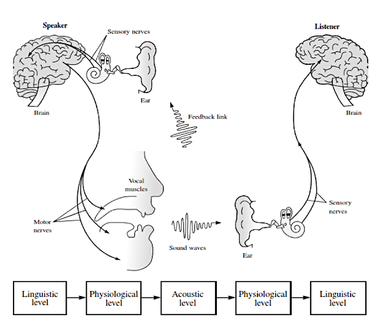

% Formal-to-some-extent notes
% Arianna Masciolini

# Introduction to Formal Linguistics

- FL is only formal to some extent, so not as a binary notion. This is due to the fact that the object of study is natural language, which is ambiguous -> levels of “formalness”
- Precursors: 

  - Pāṇini (Sanskrit philologist, IV century BCE)
  - various Greek philosophers
  - XIX century: 
    - historical & diachronic perspective
    - Hermann Paul: compositionality (sentences are the sum of their parts, not quite true but useful)
  - XX century: Saussure -> ~~Synchronic~~ (…)
- Pioneer: __Noam Chomsky__ (mid 50s) - principal contributions:
  - Syntactic structures (using mathematical tools in language analysis)
  - Chomsky hierarchy
  

# Overview of linguistics

## Methods

- _corpus_ linguistics (= study of language as expressed in _corpora_ of "real world" text. If collected in natural context (_realia_), effectiveness improves)
- formal analysis
- experimental methods (a wide variety)
- ethno-methodology (= conversation analysis, i.e. just observe language in context, used in anthropology)

## Subfields

Main subfields:

- **Phonetics** (deals with the _production of speech sounds_)
  - articulatory -> IPA chart (phonetic alphabet)
  - acoustic (physics side of things)
- **Phonology** (is about _patterns of sounds conveying a meaning_) -> phonemes, phonological rules
- **Morphology** (= study of the different forms words have, no clear boundary with syntax, cf. compounding in German and Swedish)
  - inflectional: about different forms in a paradigmrgb(20, 20, 20), singular VS plural, feminine vs masculine…
  - derivational: about how to create new words from existing ones (possibly in another category, e.g. adjectives from nouns)
- **Syntax/Grammar** (= set of [formally expressed, assuming that natural language is context free] structural rules governing the composition of clauses, phrases and words)
- **Semantics** (= study of the meaning) (uses propositional & first order logic, model theory (somehow closely related to set theory) and inference (formal & pragmatic, i.e. common sense inference)
- **Pragmatics** (= study of language _in use_): difference between what we say & what we communicate, dynamic meaning
- **Lexicon** (= inventories of words [+ idioms])

Secondary subfields:

- historical linguistics
- comparative linguistics & typology
- (…)

# Expression types

- __Lexical expressions__: require the speaker to turn to the lexicon in order to express a particular nuance of meaning (e.g. _stem suppletion_: “go” -> “went” and _isomorphism_ -> in English the past tense of “hit” is still “hit”)
- __morphological processes__: require to alter the form of a word in some predictable way
- __syntactic patterns__: express meaning variations by combination and rearrangement of lexical items.

# The origins of language

There is a lot of speculation on the origin of language (but not a definitive explanation) - possible sources:

- __divine__ (cf. Genesis & Hindu traditions) -> numerous vain attempts to rediscover the (only) original divine language (before Babel)
- __natural sounds__:
  - “bow-wow” theory (based on onomatopoeia): does not explain words for silent objects or abstract concepts, assumes that language is only a list of names for things
  - “pooh-pooh” theory (based on instinctive sounds people make in emotional circumstances): these sounds are emitted in a way which differs significantly from speech (when we inhale, not when we exhale)
- __social interaction__ -> “yo-he-ho” (= “oh issa!”) theory (sounds used to coordinate a physical effort) (good idea, but still, what is the source of these sounds?)
- __physical adaptation__ (evolution of teeth, lips, tongue, larynx, pharynx and so on)
- __tool making__ (based on the fact that the areas of the brain and brain activity involved in complex vocalisation and tool making are remarkably similar)
- __genetic__ (__innateness hypothesis__)

## Computational linguistics (aka NLP etc.)

> Computational linguistics : Linguistics 
> 	= 
> NLP : CS 
> 	= 
> speech recognition : electrical engineering 
> 	= 
> computational psycholinguistics : psychology

Natural Language Processing differs from other data processing tasks because it requires knowledge of language. One of the main problems is the __ambiguity__ of natural language (-> lexical and semantic disambiguation, probabilistic parsing). 

## Tasks

The objective of NLP is to make computers perform tasks involving natural language, e.g.:

- improving human-human communication
  - machine translation
- enabling human-computer communication
  - dialogue systems (aka conversational agents)
  - web-based question answering (solved for yes/no and factoid questions)
- performing text and/or speech processing
  - TTS (Text To Speech)
  - STT (Speech To text)
  - grammar & spell checking

## Tools

- State machines
- rule systems
- probabilistic models & machine learning
- vector-space models
- predicate & first-order logic
- classic search algorithms such as depth & breadth first search and A* search

## Chronology

- 1936: automata (Turing)
- 1943: McCulloch-Pitts neuron
- 1950: Turing test, first speech recognition systems (Bell Labs)
- 1956: CFG (Chomsky) and other formal language theory
- 1957-60: division into symbolic (formal languages + “classic” AI by McCarthy, Minsky etc.) & stochastic paradigm
  - 1966: ELIZA (Emacs’ doctor)
  - Logic Theorist (theorem prover)
  - first online corpora
- 1970s-90s: ulterior subdivision into four fields:
  - stochastic paradigm
  - logic-based paradigm -> logic programming
  - natural language understanding (1972: SHRDLU)
  - discourse modelling
- 2000+: rise of machine learning 

# Miscellaneous & my own thoughts

- > noun, verb, adjective… : types = sentence, syntagm… : composition type (similar to types & function types?)

- language differ only to some extent -> **real & statistical _language universals_**

- not so easy to define what a native speaker is

# Morphology

> __Morphology__ = the study of words: what they are how they are formed and their different forms

In language technology, it is involved in:

- analysis: parsing, speech recognition, machine translation
- generation: language generation, machine translation

## Leading figures

1.  Pāṇini (India, IV century BCE), Greek and Arabic authors
2.  De Saussure (Switzerland, late XIX and early XX century)
3.  Bloomfield (USA, early XX century)
4.  Roman Jakobsson (Prague school, Czech Republic, first half of the XX century)

## Essential vocabulary

- _Lexeme_ = abstract lexical entity consisting of __form + meaning__. It represents a
  set of forms (note: this is according to the slides. I actually think that a better definition would be: “__basic unit of a language with *lexical meaning*__ consisting of one or several words, the elements of which do not separately convey the (lexical) meaning of the whole”)
  
- _Root_ = basic part of a lexeme not further analysable either in terms of inflectional or derivational morphology, always present in every form (note: compounds have two roots)

- _Stem_ = a root or a root + a derivational morpheme changing its meaning (example: “deduce” is a stem but not a root, as it can be analysed in terms of “de” + “duce”)

- _Lemma_ = basic form that represents the word e.g. in a dictionary

- _Word form_ or _orthographic word_ = a certain form of a certain lemma (e.g. the feminine form of an adjective in Italian, the bestämd form of a Swedish word or the past simple of an English verb)

- _String_ = sequence of characters

- _Morpheme_ = smallest meaningful unit (of a word). By _meaningful_, we refer both to lexical and grammatical (see below), e.g. the word “unfair” is composed of two morphemes (“un” + “fair”). They are divided into:
  - _free_ (standalone) morphemes
  - _bound_ morphemes (the _base_ of a word is the part to which bound morphemes are attached): 
    - roots
    - affixes (prefixes, suffixes, infixes, circumfixes)
    - clitics: depend on other words, their host word can belong to several classes of words. Example: “the”, “a”
  
  Can also be divided into:
  
  - _lexical_
  - _grammatical_ (with one ore more meanings attached at the same time, cf. verb suffuxes in Spanish ans Italian. In this latter case they are called _portmanteau morphemes_)
  
- _Morph_ = A phonetic (and sometimes orthographic) representation of a morpheme. Different morphemes associated with the same meaning are called _allomorphs_. Examples:
  - the plural of the Swedish word “**fågel**” is “**fågl**ar”. “Fågel” and “fågl” are then allomorphs
  - “-s” and “-es” are allomorphs of the English plural morpheme

## Content vs function words

- _Content words_: __words with a clear *lexical meaning*__ (nouns, verbs, adjectives. Note that these classes of words all are _open classes_, i.e. it is possible to add them new words)
- _Function words_ : __words__ with no clear lexical meaning, __which__ instead __specify *grammatical functions* and relationships__ (conjunctions, prepositions, articles, pronouns. Note how they are all [almost: cf. “hen” in Swedish!] _closed classes_)

The brain treats content and functions words differently! In fact:

- Some aphasics are unable to read function words like “in” or “which”, but can read the lexical words “inn” and “witch”
- __In early stages of development children often omit function words

## Word formation (morphological) processes

- _Coining_ (= making up new terms)
- _Loan_ (from other languages): andante, oxymoron, balonvolea…
- _Calque_ or _loan translation_: e-post, skyskrapa, scannerizzare…
- _Acronym_: ISA (Instruction Set Architecture), FLOSS (Free, Libre and Open Source)…
- _Clipping_ (word shortening): math, fax, phone…
- _Blending_ of the first part of the word with the ending part of another: brunch, smog, bankomat
- _Compounding_: putting together 2+ lexemes that could function as independent words
- _Derivation_: process that __turns a word into another word__, often happens via _derivational affixes_ such as “-ism”. 
- _Inflection_: process that __creates a new word *form*__

### Derivation vs inflection

|                                                | __Inflection__                           | __Derivation__ |
| ---------------------------------------------- | ---------------------------------------- | -------------- |
| creates a new part of speech (change of class) | rarely                                   | often          |
| creates a new lexeme                           | yes                                      | no             |
| changes in meaning (?)                         | significant                              | modification   |
| semantic effect                                | sometimes hard to predict: odjur, oväder | predictable    |

## Morpheme analysis

1. Structure the word forms
2. compare two forms which are as similar as possible and identify their common-and-not features (morphs/morphemes)
3. check what role the morphs that have been isolated have in other forms
4. check that the isolated morphs are in fact morphs in that they are “minimum”  

## Typology (based on morphology)

Languages are grouped into categories based on morphology:

- **analytic**: one word, one morpheme, one meaning component (Chinese, English to a certain extent)

- **agglutinating**: one meaning per morpheme, words composed of several morphemes: (Turkish)
- **synthetic**
  - **inflectional**: several meanings per morpheme (Latin, Greek, English)	
  - **poly-synthetic**: a single word is possibly a sentence (Icelandic)
  - **non-concatenative**: base made of consonants, vowels infixed (Arabic, Hebrew)

## Morphology “problems”

- Where to split words? (“hoppa-r” or “hopp-ar”)
- what if there are multiple stems? (“vado”, “andare”)
- function or content? (“stor-het” vs “stor-lek”)
- what if identical morphs of the same lexeme indicate different morphemes? (e.g. Swedish adjectives terminate in “”-a” both in singular bestämd form and in plural obestämd form)

## Relationship with other subfields of linguistics

### Morphosyntax

It’s often useful to talk about morphology and syntax together because some things are expressed morphologically in a language and syntactically in another.

### Lexicon

Lexicon should perhaps be considered alongside morphology and syntax. We shall define lexicon later on, but for now let’s just say that according to one possible (and rather broad) its “units”, called _lexical entries_ are idealised mental constructs such as the syntactic pattern “PREPOSITION + NOUN PHRASE” in English.

## Computational morphology

### Regular expressions

> Regular expressions (regex) are an algebraic notation for characterising sets of strings. 

They are made of _atomic symbols_ (lowercase Latin letters) and operations. The fundamental ones are:

- __concatenation__ (no symbol: two expressions one next to the other are concatenated)
- __Kleene closure__ (denoted by `*`)

There are also some more specific useful operators (there are actually various conventions though):

| Operator | Meaning                                                      |
| -------- | ------------------------------------------------------------ |
| `?`      | the preceding character or nothing                           |
| `*`      | 0+ occurrences of the previous characters (well, this is just Kleenee) |
| `+`      | 1+ occurrences of the previous character                     |
| `.`      | whatever single character                                    |
| `^`      | start of the line (e.g. `^ the` mathces lines starting with “the”) |
| `$`      | end of the line                                              |
| `\d`     | any digit                                                    |
| `\D`     | any non-digit                                                |
| `\w`     | any alphanumeric character                                   |
| `\W`     | any non-alphanumeric character                               |
| `\s`     | whitespace                                                   |
| `\S`     | non-whitespace                                               |
| `|`      | logical or (usage: like `^`)                                 |
| `()`     | precedence (e.g. `(y|ies)`)                                  |

#### Brackets

Some examples to illustrate the usage of the `[]` operator:

| Example expression | Matched characters |
| ------------------ | ------------------ |
| [Aa]               | A, a               |
| [A-Z]              | A, …, Z            |
| [0-9]              | 0, …, 9            |
| [a-z]              | a, …, z            |
| [0-9 A-Z]          | 0, …, 9, a, …, z   |

### Finite-state automata

FSA are _directed graphs_ where nodes represent *states* and arcs, labelled with symbols, represent transitions.

They can also be represented as _transition tables_ (see example below).

More formally (but only to some extent because we haven’t defined everything),

> A FSA is a 5-uple
> $$
> <Q, \Sigma, q_0, F, \delta>
> $$
> where:
>
> - $Q$ is the set of states
> - $\Sigma$ is the (finite) _alphabet_
> - $q_0$ is the _start state_
>
> - $F \subseteq Q$ is a set of _final states_ (aka _accept states_)
> - $\delta : Q \times \Sigma \to Q$ is a transition function between states

#### Example

- $Q = {q_0, q_1}$
- $\Sigma = {a,b}$
- $q_0 = q_0$ (oh well!)
- $F = {q_1}$
- transition function (as a transition table): TODO

### Relationship between FSA, regular languages and regex

- regex _denote_ regular languages
- regex _compile into_ FSA
- FSA _accept_ (but also, from another point of view, _generate_)  regular languages

# Phonetics & phonology

## Phonetics

> __Phonetics__ = the study of speech sounds from a _physical_ (not functional) point of view. It deals with both the _production_ (speech apparatus) and the _perception_ (auditory apparatus) of speech sounds. It is __language independent__.

Only 2-300 sounds are needed to represents _all_ sounds in _all_ the 5000-8000 different languages across the world, and each language only selects a part of them (no more than 50).

### Main subfields and methodologies

| Subfield                   | Object                           | Experimental methods                                         |
| -------------------------- | -------------------------------- | ------------------------------------------------------------ |
| __articulatory__ phonetics | speech production, speaker       | electropalatography, x-rays, ultrasounds, physiological measurements of nasal and oral flow |
| __acoustic__ phonetics     | speech acoustic, physical medium | waveform, spectrogram, spectra, intensity curves and pitch tracks analysis |
| __perceptual__ phonetics   | perception, hearer               | eye tracking (for reading), identification & discrimination experiments with auditory stimuli |

Other methods: qualitative studies, corpora-based studies.

### Sound classification

Sounds are classified based on the following aspects.

#### Initiation

- __airstream mechanism__:

  | Mechanism name | Source of energy |
  | -------------- | ---------------- |
  | **pulmonic**   | lungs            |
  | **glottalic**  | glottis          |
  | **velaric**    | tongue           |

- _airflow direction__:

  - egressive
  - ingressive (e.g. that weird sound that Swedes sometimes make instead of just saying “ja”)

Inexhaustive classification based on initiation:

| Sound type    | Characteristics      |
| ------------- | -------------------- |
| __ejective__  | glottalic egressive  |
| __implosive__ | glottalic ingressive |
| __click__     | velaric ingressive   |

#### Phonation

Larynx (voice box) and vocal folds.

Classification of consonants based on phonation (not valid for all languages):

- voiced (e.g. [f]) - vocal cords vibrate
- voiceless (e.g. [v]) - vocal cords do not vibrate

#### Articulation

- _place_ of articulation:

  - oral

  - nasal

  - active (i.e. moving) articulators: lower lip, tongue

  - passive articulators: upper lip and teeth, upper oral cavity, back wall of the pharynx…

    ##### Classification of some consonants based on phonation and articulation

    | Group             | Consonant (IPA) | Phonation | Oral/nasal | Articulators                                                 |
    | ----------------- | --------------- | --------- | ---------- | ------------------------------------------------------------ |
    | **bilabial**      | [p]             | voiceless | oral       | the two lips (closed)                                        |
    | **bilabial**      | [m]             | voiced    | nasal      | the two lips (closed)                                        |
    | **labiodental**   | [v]             | voiced    | oral       | active: lower lip; passive: upper teeth                      |
    | **dental**        | [θ]             | voiceless | oral       | active: tongue blade or tip; passive: upper teeth            |
    | **alveolar**      | [t]             | voiceless | oral       | active: tongue blade or tip; passive: alveolar ridge         |
    | **post-alveolar** | [ʃ]             | voiceless | oral       | active: tongue blade or tip; passive: area behind the alveolar ridge |
    | **palatal**       | [c]             | voiceless | oral       | active: middle or back part of the tongue; passive: hard palate |
    | **velar**         | [k]             | voiced    | oral       | active: back part of the tongue; passive: soft palate        |
    | **uvular**        | [χ]             | voiced    | oral       | active: back part of the tongue; passive: uvula              |
    | **pharyngeal**    | [ħ]             | voiceless | oral       | active: root of the tongue; passive: pharynx                 |
    | **glottal**       | [h]             | voiceless | oral       | glottis                                                      |

    

- _degree_ of stricture:

  - open approximation -> resonants
  - close approximation -> fricatives
  - complete closure -> stops

- _aspect_ of articulation

  - _conformational_:
    - oral VS nasal (again?)
    - central VS lateral (another way to distinguish between resonants and fricatives)
  - _topographical_ (tongue surface convex/concave):
    - grooved (fricatives)
    2. retroflex (stops, fricatives and resonants)
    3. cupped (stops, fricatives and resonants)
    4. withdrawn tongue root (resonants)
    5. extented of the tongue tip (stops, fricatives, and resonants)
    6. advancement of the tongue root (ATR) (stops, fricatives and
    resonants)
  - _transitional_ (steady/dynamic):
    - flapped (stops, fricatives and resonants)
    2. tapped (stops and fricatives)
    3. trilled (stops and fricatives)
    4. diphthongal (resonants)
    5. triphthongal (resonants)

#### Co-ordination

Co-ordination is represented via diacritics (not listed here) in the IPA.

- __devoicing__ (partial, initial or final)
- __release__ 
- __plosion__ (oral, nasal, central, lateral)
- __aspiration__
- __affrication__ (stop + fricative)
- __length__

## Prosody

Stress, pitch accent, intonation…

## The International Phonetic Alphabet

### Consonants in the IPA

### Vowels in the IPA

Vowels in the IPA are categorised based on:

- **height** (close/open, referred to the position of the tongue)
- **location** (front/central/back)
- lip position (spread/neutral/rounded)

Where symbols appear in pairs, the one to the right represents a rounded vowel.

Other characteristics of vowel sounds:

- length
- nasalisation

#### Diphthongs

> A **diphthong** is made of two adjacent vowels in the same syllables. The two vowelsusually have different _quality_.

Types of diphthongs:

- _falling_ or _descending_ (the vowel with higher prominence comes first) VS _rising_ or _ascending__ (the vowel with lower prominence comes first)
- _closing_ (the more open vowel comes first) VS _opening_ (the more closed vowel comes first)
- _centering_(the second vowel quality is more central)

### Acoustics

Inexhaustive list of mentioned things:

- plosives/stops (again)
- fricatives (again)
- affricates (again)
- trills
- flaps
- taps
- nasals (again)
- approximants (= glides)
- laterals & rhotics (= liquids)

## Phonology

> __Phonology__ = study of the systematic, __language dependent__ aspects of sounds, like their distinctive functions.

### Phonemes and allophones

> __Phoneme__ = minimal sound unit distinguishing meaning in a certain language. Not meaningful by itself.

An _allophone_ is a variant of an phoneme that does not change the meaning -> “è” and “é” in southern Italy -> _substitution test_, two words form a _minimal pair_ if they only differ by one phoneme

### Phonotactics

Phonotactics is a part of phonology which treats how different phonemes can be combined in a certain language (example: how many consonants can you have in a row?).

## Transcriptions

Do not confuse **phonetic transcriptions** (enclosed in […] and very close to the “actual pronunciation”) with **_phonemic_ transcriptions** (more abstract and phoneme based, enclosed in /…/).

On top of this, there are _**graphemes**_, i.e. alphabetic characters of the various writing systems, sometimes enclosed in <…>. The study of the different writing systems is called _graphonomics_.